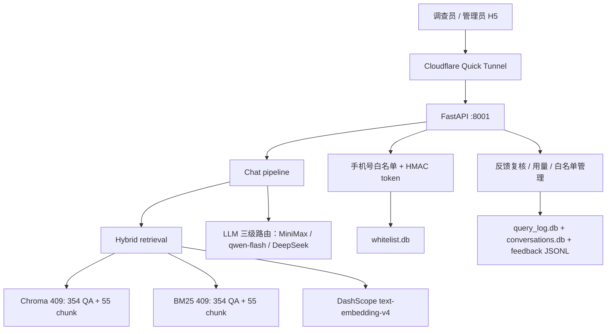

# 架构设计

> 2026-06-21 更新：原"微信小程序"已改为 H5 单页应用（详见 ADR 0001）；ASR 由"腾讯云"改为"讯飞实时语音转写大模型"（WebSocket 流式）；部署由"云服务器 + Nginx + systemd"改为"本地电脑 + Cloudflare Tunnel quick"（详见 ADR 0004）。
>
> 2026-06-21 补充：语音识别（讯飞 ASR + WebSocket `/api/voice/stream` + H5 麦克风 UI）**已停用**。原因：现代手机输入法自带语音转写，无需后端再做一遍。后端代码完整保留（路由在 main.py 注释），未来可恢复。恢复步骤见 `.env.example` 注释。

## 一、系统总览



- 对话、反馈和管理 API 都要求登录 token；`/api/auth/login` 与 `/api/auth/check` 负责门禁。
- Chroma 与 BM25 都覆盖 QA/chunk 双数据源，两个索引的现行总量均为 409。
- 语音路由已停用，手机输入法承担语音转写，详见 ADR 0009。
- 会话历史持久化在 `conversations.db`，按手机号隔离；删除会话为物理删除，反馈与 query log 保留。
- 前台空状态展示近一月热点 QA；聚合失败时降级为 `backend/data/default_questions.json`。

---

## 二、数据流

### 2.1 在线问答流程（文字输入）

```
1. 用户在 H5 聊天页输入问题，点击发送
2. 前端 fetch POST /api/chat
   body: { message: "就业人口怎么判断", conversation_id: "..." }
3. FastAPI 路由 (app/api/chat.py) 接收请求
4. 路由编排 (app/api/chat.py)：
   a. 越界判断（is_in_scope）→ 拒绝非劳动力调查问题
   b. 模糊判断（is_ambiguous）→ 追问补全
   c. 会话存在时由服务端加载最近 8 条消息；否则兼容旧端请求内 history
   d. Hybrid 检索：Chroma 向量 + BM25 关键词融合
5. Prompt 组装 (app/rag/prompts.py)：
   a. 加载系统提示词（SYSTEM_PROMPT）
   b. 把检索结果格式化为 kb_results
   c. 拼接用户问题（USER_TEMPLATE）
6. 调用 LLM 三级路由（app/rag/llm.py）
7. 检测 LLM 是否触发"未找到"模板 → 切换 mode
8. RAG 命中时追加 grounding 锚点；成功轮次写入 conversations.db
9. 后端把结果（含 sources、mode、retrieval_score、conversation_id）返回 H5
10. H5 渲染：答案 + 参考资料（可展开）+ 反馈按钮
```

### 2.2 语音问答流程（**2026-06-21 已停用**）

> 输入法自带语音转写，无需后端再做一遍。流程保留作为历史参考。

```
1. 用户点击 H5 麦克风按钮，浏览器请求 getUserMedia
2. Web Audio API 以 16kHz 采样率录音（AudioContext 强制重采样）
3. ScriptProcessor 每 4096 帧 (~256ms) 把 PCM Int16 通过 WebSocket 发送
4. WebSocket: /api/voice/stream
   - 后端先调讯飞鉴权（app/api/_xunfei_auth.py）拿到动态 token
   - 建立与讯飞的 WebSocket 双向流
   - 浏览器 PCM 音频 → 后端 → 讯飞
   - 讯飞 partial 结果 → 后端 → 浏览器（H5 显示"识别中…"）
5. 用户再次点击麦克风，发送 "__end__" 结束符
6. 讯飞返回 final 文本
7. H5 把 final 文本填入输入框，用户点发送走 2.1
```

### 2.3 反馈流程

```
1. 用户对 RAG 命中答案点击“采纳”，或点击“答案不正确，反馈”。
2. 负面反馈在弹窗必填正确答案与依据；H5 POST /api/feedback。
3. 后端校验 mode/request_id/长度，并按 phone + request_id 去重后写入 feedback.jsonl。
4. 系统管理员在 Dashboard 将反馈标记为 accepted / rejected；复核事件追加到 feedback_resolved.jsonl，最新复核状态生效。
```

---

## 三、API 接口详细

### 3.1 POST /api/chat

**请求**：
```json
{
  "message": "就业人口怎么判断",
  "conversation_id": null,
  "top_k": 5
}
```
- `message` 必填，1-500 字符
- `conversation_id` 可选；提供后由服务端加载上下文并续接会话
- `top_k` 可选，1-20，默认走 settings.top_k

**响应**：
```json
{
  "answer": "根据劳动力调查制度...",
  "sources": [
    {
      "qa_id": "223",
      "question": "干1小时的零工算不算就业？",
      "source": "劳动力调查制度（2026版）第三部分·问题10",
      "category": "就业状态判断",
      "score": 0.7655
    }
  ],
  "mode": "rag",
  "retrieval_score": 0.7655,
  "request_id": "a1b2c3d4e5f6",
  "conversation_id": "0123456789abcdef"
}
```
- `mode` 取值：`rag`（命中）/ `out_of_kb`（知识库无答案）/ `out_of_scope`（越界）/ `ambiguous`（追问）

### 3.2 WebSocket /api/voice/stream（**2026-06-21 已停用**）

> 路由在 `main.py` 已注释。文档保留作为历史参考。

**协议**：浏览器原生 WebSocket，`binaryType = "arraybuffer"`

**上行**（浏览器 → 后端）：
- 二进制帧：16kHz 单声道 PCM Int16LE，每帧 4096 样本
- 文本帧 `"__end__"`：结束录音

**下行**（后端 → 浏览器）：
```json
{ "type": "partial", "text": "每周工作", "final": false }
{ "type": "partial", "text": "每周工作15小时算就业", "final": true }
{ "type": "error", "code": "...", "msg": "..." }
```

**鉴权**：浏览器无需提供讯飞凭据，后端用 `.env` 里的 `XUNFEI_*` 在服务端代为获取 token。

### 3.3 POST /api/feedback

**请求**：
```json
{
  "question": "...",
  "answer": "...",
  "mode": "rag",
  "rating": "up",
  "comment": "",
  "corrected_answer": "",
  "evidence": "",
  "request_id": "a1b2c3d4e5f6",
  "sources": [...]
}
```

**响应**：
```json
{ "ok": true, "record_id": "fb_20260621_xxx" }
```

### 3.4 GET /

返回 H5 单页应用 `backend/static/index.html`（FileResponse）。

### 3.5 GET /health

**响应**：
```json
{
  "status": "ok",
  "chroma_count": 303,
  "llm_configured": true
}
```

### 3.6 GET /api/chat/hot-questions

返回近一月热点问题，最多 5 条；无热点或聚合失败时返回默认问题。

```json
{ "items": [{ "question": "每周工作15小时算就业吗？" }] }
```

### 3.7 会话历史 API

| 方法与路径 | 说明 |
|---|---|
| `GET /api/chat/conversations?limit=10&offset=0` | 返回当前手机号的会话标题分页列表，每页最多 10 个 |
| `GET /api/chat/conversations/{conversation_id}/messages` | 返回最近 10 轮（20 条）消息和已提交反馈状态 |
| `DELETE /api/chat/conversations/{conversation_id}` | 物理删除当前手机号的会话及消息 |

---

## 四、模块职责

### 4.1 后端（backend/app/）

| 模块 | 职责 |
|------|------|
| `main.py` | FastAPI 应用入口、路由注册、静态文件挂载 |
| `api/chat.py` | `/api/chat` 路由，越界/模糊/检索/LLM 编排；加载最近 8 条服务端上下文，记录 `top_qa_id`，并为 RAG 回答追加 grounding 锚点 |
| `api/conversations.py` | 会话列表、最近 10 轮消息、物理删除；全部按当前手机号隔离 |
| `api/auth.py` | `/api/auth/login` + `/api/auth/check`，HMAC token 签发与校验 |
| `api/voice.py` | **（2026-06-21 已停用）** 路由在 `main.py` 注释保留 |
| `api/_xunfei_auth.py` | **（2026-06-21 已停用）** 讯飞鉴权（仅供未来恢复） |
| `api/feedback.py` | `/api/feedback` 接收采纳/不采纳；不采纳时提交修正答案与依据，写入 feedback.jsonl |
| `api/feedback_admin.py` | 系统管理员反馈统计、复核状态更新、KB 改进候选与区域下钻 |
| `api/hot_questions.py` | `/api/chat/hot-questions`，返回近一月热点；失败时降级为默认问题 |
| `rag/retriever.py` | 越界/模糊判断 + Chroma 检索 |
| `rag/bm25.py` | BM25 索引加载、关键词打分（hybrid 用） |
| `rag/llm.py` | MiniMax / DashScope / DeepSeek LLM 调用与三级路由 |
| `rag/prompts.py` | SYSTEM_PROMPT / USER_TEMPLATE / format_kb_results |
| `rag/grounding.py` | 从 top-1 KB 条目推导并补充关键词、场景与指标锚点 |
| `persistence/query_log.py` | 查询日志写入、使用统计与 `top_qa_id` 聚合 |
| `persistence/conversations.py` | `conversations.db` 的会话、消息、上下文读写与物理删除 |
| `services/hot_questions.py` | 近一月热点聚合、标准问法映射、默认问题降级与 30 分钟缓存 |
| `services/feedback_reviews.py` | 反馈复核索引与 KB 改进候选聚合 |
| `models/schemas/` | Pydantic 请求/响应模型子包（common/chat/admin） |
| `core/config.py` | 环境变量集中读取，Settings dataclass |

### 4.2 前端（backend/static/）

| 文件 | 职责 |
|------|------|
| `index.html` | 聊天主页面 SPA |
| `login.html` | 手机号白名单登录页 |
| `dashboard.html` | 统一数据看板（KB 复核队列 / 使用监测）；白名单和测验经顶部统一导航进入 |
| `whitelist.html` | 白名单管理页（CRUD + CSV 导入 + 翻页） |
| `common.js` | 共享前端工具（$ / escapeHtml / token 管理） |

UI 模块（全部内联在 index.html）：
- 聊天列表（用户气泡 / 助手气泡 / mode 标签 / 参考资料展开）
- 历史对话抽屉（最近会话列表、最近 10 轮回看、物理删除）
- 输入区（textarea + 发送按钮）
- 反馈区（采纳按钮 + “答案不正确，反馈”弹窗，要求填写修正答案与依据）
- 近一月热点问题示例
- 状态指示（在线/连接中/不可达）

### 4.3 知识库（knowledge-base/）

| 路径 | 职责 |
|------|------|
| `raw/` | 原始制度文档（PDF/Word/Markdown），不修改 |
| `qa/faq.json` | 结构化 QA 数据（手动维护） |
| `qa/eval_set.json` | 评估集（构造的问答对，用于评估检索质量） |
| `scripts/build_kb.py` | QA JSON → Chroma 向量库 |
| `scripts/build_bm25.py` | QA JSON → BM25 索引 |
| `scripts/validate_faq.py` | QA 字段完整性校验 |
| `scripts/run_eval.py` | 用 eval_set 跑检索评估 |

---

## 五、部署架构

### 5.1 本机部署（当前）

```
用户电脑（Windows 11）
├── scripts\start_tunnel.bat 一键启动
│   ├── uvicorn app.main:app --port 8001
│   └── cloudflared tunnel --url http://localhost:8001 --protocol quic
│       └── 输出 https://xxx.trycloudflare.com 链接
│
├── 浏览器打开链接 → H5 聊天页
│   └── fetch /api/chat, /api/feedback（需 Authorization: Bearer）
│
├── 数据文件
│   ├── backend/data/chroma/  向量库
│   ├── backend/data/bm25_index.json  BM25（双源 409 = 354 QA + 55 chunk）
│   ├── backend/data/feedback.jsonl  反馈日志（不入 git）
│   ├── backend/data/feedback_resolved.jsonl  反馈复核事件（不入 git）
│   ├── backend/data/conversations.db  服务端永久会话库（不入 git）
│   ├── backend/data/default_questions.json  热点兜底问题（配置）
│   ├── backend/data/query_log.db    SQLite 查询日志（不入 git）
│   └── backend/data/whitelist.db    SQLite 白名单（不入 git）
│
└── .env  环境变量（API Keys 等）
```

**约束**：
- 电脑关机 = 服务下线，链接失效
- 公网 IP 变化 = 不影响（Cloudflare 边缘维持隧道）
- 同一时刻 1 个 quick tunnel（域名每次启动变）

### 5.2 启动流程

```cmd
:: 首次：安装 cloudflared
winget install --id Cloudflare.cloudflared --accept-package-agreements --accept-source-agreements

:: 每次启动
cd D:\code_codex\labor-survey-ai
scripts\start_tunnel.bat
:: 把输出的 https://xxx.trycloudflare.com 链接发给同事
::
:: 启动后 uvicorn 异常可由 scripts\watchdog_api.ps1 拉起（每 60s 探一次 /api/auth/check）
```

### 5.3 关停

- 关闭 `scripts\start_tunnel.bat` 窗口 → 后端和 tunnel 同时停止，端口 8001 释放

---

## 六、性能与可扩展性

### 6.1 实际表现（处室自用，2-5 并发）

| 指标 | 实测 |
|------|------|
| 端到端延迟（在线问答，本地） | ~3-9s（主要在 LLM 调用） |
| 端到端延迟（在线问答，公网） | ~4-12s（+ Cloudflare 隧道） |
| 语音转写延迟 | **（2026-06-21 已停用）** partial 反馈 < 1s，final < 2s |
| `/health` 响应 | < 50ms |
| H5 页面加载 | < 5s（公网） |

**压测校准（2026-06-29，4 档：baseline/20/50/100 并发）**：

| 阶段 | QPS | P50 | P95 | 5xx |
|------|-----|-----|-----|-----|
| baseline (1) | 0.33 | 2.8s | 4.3s | 0 |
| 20 | 5.9 | 3.3s | 4.6s | 0 |
| 50 | 10.7 | 4.5s | 6.4s | 1 |
| 100 | 11.4 | 9.0s | 11.9s | 0 |

300 调查员预期峰值 50-80 并发 → P95 6-9s 在可接受范围。完整数据 `reports/load-test-20260629-1932.md` + workers=1 vs 2 对比 `reports/load-test-20260629-2058.md`。

### 6.2 扩展路径

> ⚠️ **2026-06-29 压测结论**：以下路径按"瓶颈在 uvicorn 进程数"的假设列出，但实测表明**真实瓶颈是 DeepSeek 每账号并发连接上限 ≈ 45**，不在后端扩缩容手段。完整分析 `reports/llm-bottleneck-analysis-20260629.md`。

- **数据量增长**（QA > 1000 条）：Chroma 切 Milvus / Qdrant（独立服务）
- **用户量增长**（> 50 并发撞 DeepSeek 上限）：**等 DeepSeek 提额 / 换 DashScope qwen-max**，而不是堆 uvicorn 实例（已验证无效）
- **业务扩展**（住户调查、价格调查）：知识库分库，路由层按业务分流
- **稳定性增强**：从 quick tunnel 切 named tunnel（绑定自有域名）
- **离线能力**：H5 端缓存常用 FAQ（Service Worker）
