## 第 1 页

**标题**: 统计云专用直报系统业务功能介绍朱诗宇·2024年12月5日

**备注**: 接下来进行专用直报系统业务流程及功能的介绍

> 图片内容(可检索): 统计云
一网通办一云统管

## 第 2 页

**标题**: 01

目录
平台登录
02
任务部署
03
数据采集
04
05
06
审核验收
数据汇总
数据管理

**备注**: 主要介绍内容包含
（1）系统的功能概述（2）开网前准备阶段（3）数据采集（4）审核验收 （5）数据汇总（6）查询分析

## 第 3 页

**标题**: 登录前一般由本单位统计云管理员按照各专业的要求建立专业账号和配置权限，具体请参考8月下发的《附件3  统计云联网直报系统管理员操作手册》中第4、5条。（交接工作时请做好账号权限交接，专业账号只能本人实名使用。）
专业账号配置完成后，通常通过短信验证码方式进行登录。

01 平台登录

**备注**: 进入“专用直报平台”后，按照业务流程首先要做的“开网前的准备”工作

## 第 4 页

**标题**: 01 平台登录

图1-1

**备注**: 进入“专用直报平台”后，按照业务流程首先要做的“开网前的准备”工作

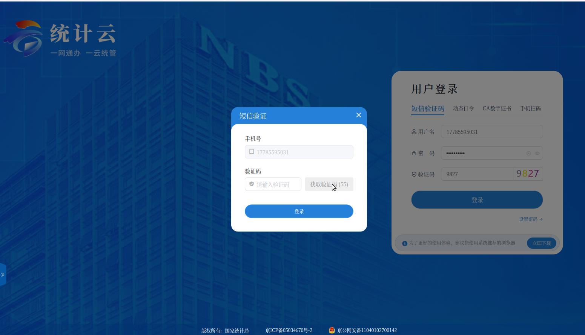

> 图片内容(可检索): 统计云
NBS
一网通办一云统管
用户登录
短信验证码
动态口令
CA数字证书
手机扫码
短信验证
吕用户名
17785595031
手机号
 17785595031
验证码
自验证码
9827
9827
请输入验证码
登录
登录
设置密码
?为了更好的使用体验，建议您使用系统推荐的浏览器
立即下载
京ICP备05034670号-2
版权所有：国家统计局
京公网安备11040102700142

## 第 5 页

**标题**: 01 平台登录

新用户（或忘记密码的用户），可在登录页面点击“设置密码”进行登录密码的设置（或重置）。
图1-2

**备注**: 进入“专用直报平台”后，按照业务流程首先要做的“开网前的准备”工作

> 图片内容(可检索): 用户登录
短信验证码
动态口令
CA数字证书
手机扫码
吕用户名
请输入用户名
邑密码
请输入密码
白验证码
请输入验证码
8218
登录
设置密码
?为了更好的使用体验，建议您使用系统推荐的浏览器
立即下载

## 第 6 页

**标题**: 01 平台登录

图1-3

**备注**: 进入“专用直报平台”后，按照业务流程首先要做的“开网前的准备”工作

> 图片内容(可检索): 手机短信验证码
设置
当前手机号：177*5031
请输入验证
50s
下一步
17785595031
请点击验证

## 第 7 页

**标题**: 01 平台登录

图1-4
根据12月4号下发的《附件1：移动统计App登录流程变更情况说明》通知，移动统计APP由更新，现在需要先下载安装统计云APP（并重新设置密码），然后下载安装V3.7版本的移动统计APP，才能够正常登陆移动统计APP，否则会无法登陆或无法获取任务。
由于平台维护导致调查员调查范围和指导员身份出现丢失或异常，如出现调查员无法获取任务（初始化进度卡在75%等）或指导员无法登陆移动统计APP，需由专业人员在统计云平台为调查员重新设置调查范围或设置指导员身份。

**备注**: 进入“专用直报平台”后，按照业务流程首先要做的“开网前的准备”工作

> 图片内容(可检索): 09:47
09:52 8
铁计云
ABS
统计云
用 P 多
地入手机号
专用真报
NICE
辅调员登录
App下载
选择系统

## 第 8 页

**标题**: 01 平台登录

图1-5
移动端调查对象列表页住户地址较长时，如何显示全部地址信息？
在调查对象列表页可点击左上角“详”，会出现弹窗，展示该地址全部信息详情。也可在报表填报页面点击住户地址，弹窗显示该户详细地址信息。

**备注**: 进入“专用直报平台”后，按照业务流程首先要做的“开网前的准备”工作

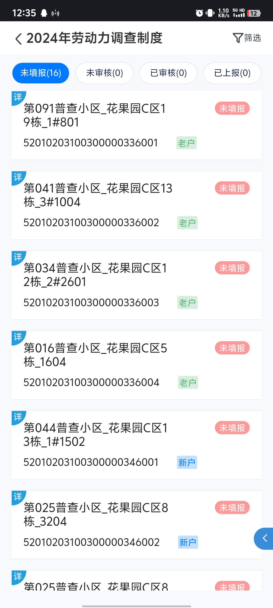

> 图片内容(可检索): 1.10
12:35
()
5G HD
12
KB/s
<2024年劳动力调查制度
√筛选
未审核(0)
未填报(16)
已审核(0)
已上报(0)
第091普查小区 花果园C区1
未填报
9栋_1#801
52010203100300000336001
老户
第041普查小区 花果园C区13
未填报
栋_3#1004
52010203100300000336002
老户
第034普查小区 花果园C区1
未填报
2栋_2#2601
52010203100300000336003
老户
第016普查小区 花果园C区5
未填报
栋_1604
52010203100300000336004
老户
第044普查小区 花果园C区1
未填报
3栋_1#1502
52010203100300000346001
第025普查小区 花果园C区8
未填报
栋_3204
52010203100300000346002
新户
第025普香小区
花果园C区8
未填报

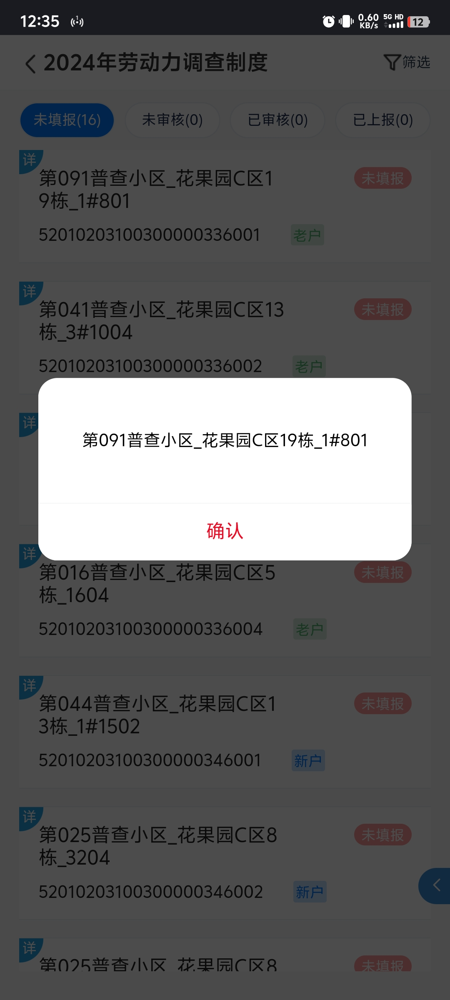

> 图片内容(可检索): 12:35(b)
0.60 5G HD
12
KB/s ..ll
<2024年劳动力调查制度
丫筛选
未审核(0)
未填报(16)
已审核(0)
已上报(0)
第091普查小区 花果园C区1
未填报
9栋_1#801
52010203100300000336001
老户
第041普查小区花果园C区13
未填报
栋_3#1004
52010203100300000336002
老户
第091普查小区 花果园C区19栋_1#801
确认
第016普查小区 花果园C区5
未填报
栋_1604
52010203100300000336004
老户
第044普查小区花果园C区1
未填报
3栋_1#1502
52010203100300000346001
新户
第025普查小区 花果园C区8
未填报
栋_3204
52010203100300000346002
新户
第025普查小区花果园C区8
未填报

## 第 9 页

**标题**: 01

目录
平台登录
02
任务部署
03
数据采集
04
05
06
审核验收
数据汇总
数据管理

**备注**: 主要介绍内容包含
（1）系统的功能概述（2）开网前准备阶段（3）数据采集（4）审核验收 （5）数据汇总（6）查询分析

## 第 10 页

**标题**: 点击进入专用直报系统

02 任务部署
图2-1

**备注**: 进入“专用直报平台”后，按照业务流程首先要做的“开网前的准备”工作

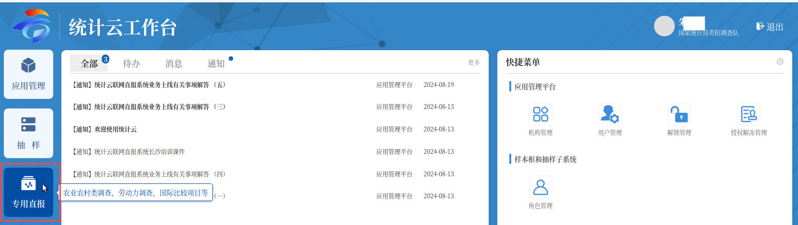

> 图片内容(可检索): 统计云工作台
退出
国家统计局贵阳调查队
全部
待办
消息
更多
通知
快捷菜单
应用管理
【通知】统计云联网直报系统业务上线有关事项解答（五
应用管理平台
2024-08-19
应用管理平台
【通知】统计云联网直报系统业务上线有关事项解答（三】
应用管理平台
2024-08-13
应用管理平台
【通知]欢迎使用统计云
2024-08-13
机构管理
用户管理
解锁管理
授权解冻管理
抽样
【通知】统计云联网直报系统长沙培训课件
应用管理平台
2024-08-13
样本框和抽样子系统
应用管理平台
【通知】统计云联网直报系统业务上线有关事项解答
(四)
2024-08-13
农业农村类调查，劳动力调查，国际比较项目等
应用管理平台
2024-08-13
专用直报
角色管理

## 第 11 页

**标题**: 自定义元数据、填报范围管理通常由国家局或总队管理设置

02 任务部署
图2-2

**备注**: 进入“专用直报平台”后，按照业务流程首先要做的“开网前的准备”工作

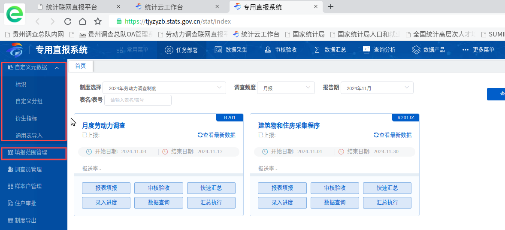

> 图片内容(可检索): 统计联网直报平台
专用直报系统
统计云工作台
 https:/tjyzyzb.stats.gov.cn/stat/index
AEws贵州调查总队OA管理系
元统计云工作台
国家统计局
贵州调查总队内网
劳动力调查联网直报平
全国统计高层次人才培
口国家统计局人口和就
 SUMI
专用直报系统
审核验收
品 常用菜单
数据采集
 数据汇总
查询分析
数据产品
任务部署
更多菜单
心自定义元数据
首页
标识
制度选择
调查频度
月报
报告期
2024年劳动力调查制度
2024年11月
表名l表号
自定义分组
请输入表名/表号
衍生指标
R201
R201JZ
月度劳动力调查
建筑物和住房采集程序
已上报：
通用表导入
Q查看最新数据
已上报：
2查看最新数据
开始日期：2024-11-03
?结束日期：2024-11-17
开始日期：2024-11-01
菌 填报范围管理
?结束日期：2024-11-30
报送率
调查员管理
报送率-
品样本户管理
报表填报
审核验收
快速汇总
报表填报
审核验收
快速汇总
录入进度
数据查询
汇总执行
录入进度
数据查询
住户审批
汇总执行
每 制度导出

## 第 12 页

**标题**: 一、新增调查员：具体请参考8月下发的《附件2  统计云应用管理平台综合管理员操作手册（V2.9）》中第4.5条。（新增调查员需由本单位统计云管理员才能操作）

2.1 调查员管理

**备注**: 进入“专用直报平台”后，按照业务流程首先要做的“开网前的准备”工作

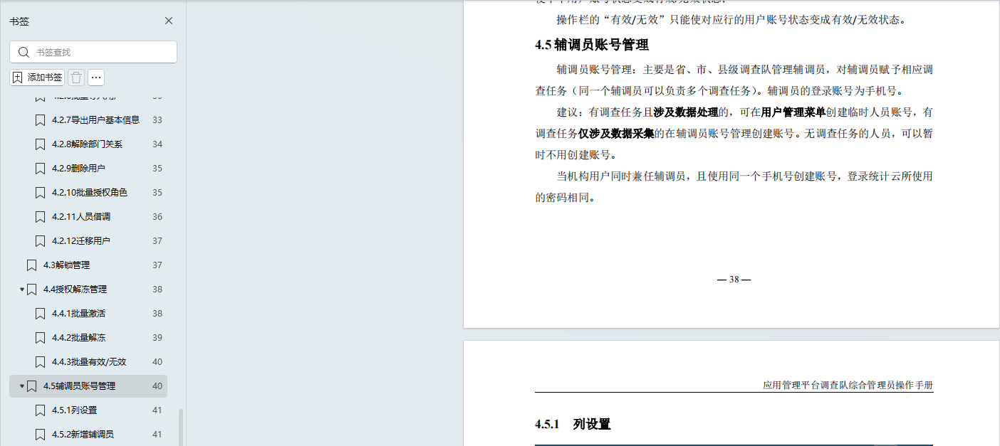

> 图片内容(可检索): 书签
4.5辅调员账号管理
书签查找
因添加书签
辅调员账号管理：主要是省、市、县级调查队管理辅调员，对辅调员赋予相应调
查任务（同一个辅调员可以负责多个调查任务）。辅调员的登录账号为手机号。
口 4.2.7导出用户基本信息
建议：有调查任务且涉及数据处理的，可在用户管理菜单创建临时人员账号，有
33
调查任务仅涉及数据采集的在辅调员账号管理创建账号。无调查任务的人员，可以暂
口4.2.8解除部门关系
34
时不用创建账号。
口 4.2.9删除用户
35
当机构用户同时兼任辅调员，且使用同一个手机号创建账号，登录统计云所使用
口4.2.10批量授权角色
35
的密码相同。
口 4.2.11人员借调
36
口 4.2.12迁移用户
37
4.3解锁管理
37
38-
口4.4授权解冻管理
38
口 4.4.1批量激活
38
口4.4.2批量解冻
39
口 4.4.3批量有效/无效
40
口 4.5辅调员账号管理
40
应用管理平台调查队综合管理员操作手册
口 4.5.1列设置
41
4.5.1
列设置
口 4.5.2新增辅调员
41

## 第 13 页

**标题**: 在统计云工作台点击进入用户管理

2.1 调查员管理
图2-3

**备注**: 进入“专用直报平台”后，按照业务流程首先要做的“开网前的准备”工作

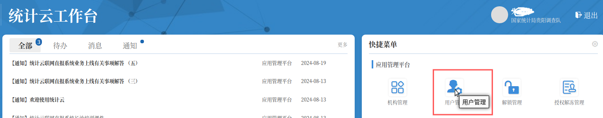

> 图片内容(可检索): 统计云工作台
退出
国家统计局贵阳调查队
全部
待办
消息
通知
更多
快捷菜单
【通知】统计云联网直报系统业务上线有关事项解答
 (五)
应用管理平台
2024-08-19
应用管理平台
[通知] 
统计云联网直报系统业务上线有关事项解容
()
应用管理平台
2024-08-13
【通知]欢迎使用统计云
应用管理平台
2024-08-13
机构管理
用户管理
用户管
解锁管理
授权解冻管理

## 第 14 页

**标题**: 点击辅调员账号管理，并在调查任务选择劳动力调查，可查看本单位（本级）劳动力调查员账号。在显示下级机构人员选择“是”，可查看下辖机构的调查员。（统计局因不归属于各市州调查队下辖机构，所以无法查看下辖统计局的调查员）
此页面可以进行新增、批量导出和导入调查员操作。

2.1 调查员管理
图2-4

**备注**: 进入“专用直报平台”后，按照业务流程首先要做的“开网前的准备”工作

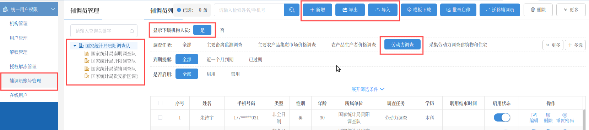

> 图片内容(可检索): 统一用户权限
已选：0条
十新增
巴导出
±导入
回删除
?模板下载
批量启停
辅调员列
二迁移辅调员
辅调员管理
请输入检索姓名手机号
更多
机构管理
请输入查询关键字
显示下级机构人员：
用户管理
调查任务：
全部
主要畜禽监测调查
农产品生产者价格调查
劳动力调查
更多
主要农产品集贸市场价格调查
采集劳动力调查建筑物和住宅
国家统计局贵阳调查队
十多选
解锁管理
国家统计局南明调查队
全部
到期提醒:
近一个月到期
国家统计局开阳调查队
已过期
授权解冻管理
国家统计局清镇调查队
全部
启用
是否启用：
国家统计局贵安新区调
禁用
辅调员账号管理
展开筛选条件√
在线用户
类型
学历
序号
姓名
手机号码
性别
年龄
所属单位
调查任务
启用状态
聘用结束时间
操作
非全日
国家统计局贵阳
177*****031
朱诗宇
本科
30
劳动力调查
编辑
删除
调查队
重置密码

## 第 15 页

**标题**: 新增：单独增加调查员，依次填写完信息保存后，在调查员列表中就可以看到新添加的调查员，所有信息（无论是否为必填项）都必须填写完整。

2.1 调查员管理
图2-5

**备注**: 进入“专用直报平台”后，按照业务流程首先要做的“开网前的准备”工作

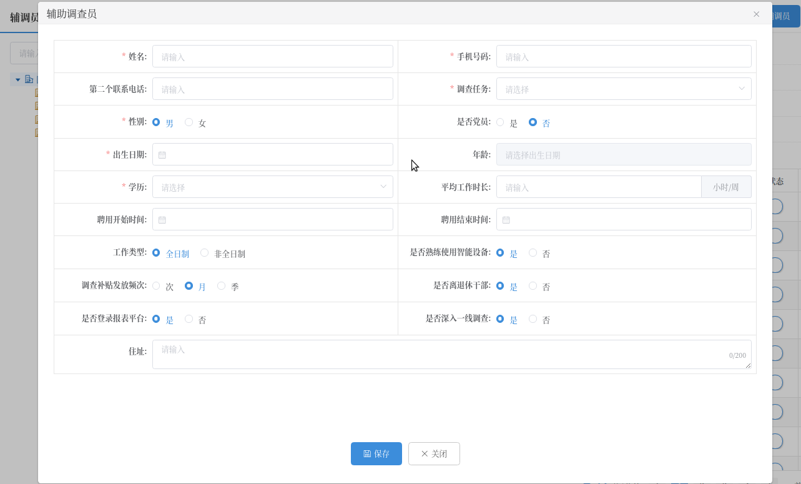

> 图片内容(可检索): 辅助调查员
辅调员
有调员
请输
*姓名：
请输入
*手机号码：
请输入
第二个联系电话：
请输入
*调查任务：
请选择
*性别：
○女
是否党员：
*出生日期：
年龄：
请选择出生日期
*学历：
请选择
平均工作时长：
请输入
小时/周
聘用开始时间：
聘用结束时间：
工作类型：
是否熟练使用智能设备：
非全日制
全日制
是否离退休干部：O
调查补贴发放频次：
是否登录报表平台：
是否深入一线调查：O
住址：
请输入
0/200
圆保存
×关闭

## 第 16 页

**标题**: 导出：按选择的列导出调查员信息。

2.1 调查员管理
图2-6

**备注**: 进入“专用直报平台”后，按照业务流程首先要做的“开网前的准备”工作

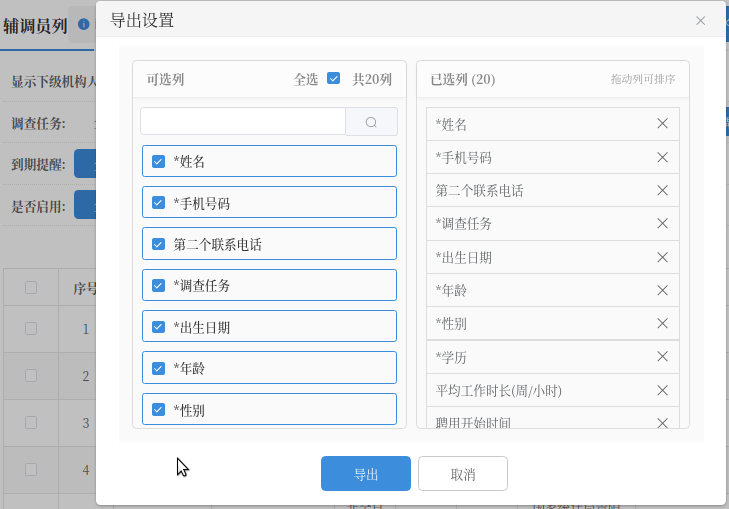

> 图片内容(可检索): 导出设置
辅调员列
可选列
全选
共20列
已选列(20)
显示下级机构人
拖动列可排序
调查任务：
*姓名
*手机号码
*姓名
到期提醒：
第二个联系电话
是否启用：
*手机号码
*调查任务
第二个联系电话
*出生日期
序号
*调查任务
*年龄
*性别
*出生日期
*学历
*年龄
平均工作时长(周/小时)
*性别
聘用开始时间
导出
取消

## 第 17 页

**标题**: 模板下载：批量导入调查员信息首先需要下载模板，然后按模板示例完整填写需要导入的调查员信息。

2.1 调查员管理
图2-7

**备注**: 进入“专用直报平台”后，按照业务流程首先要做的“开网前的准备”工作

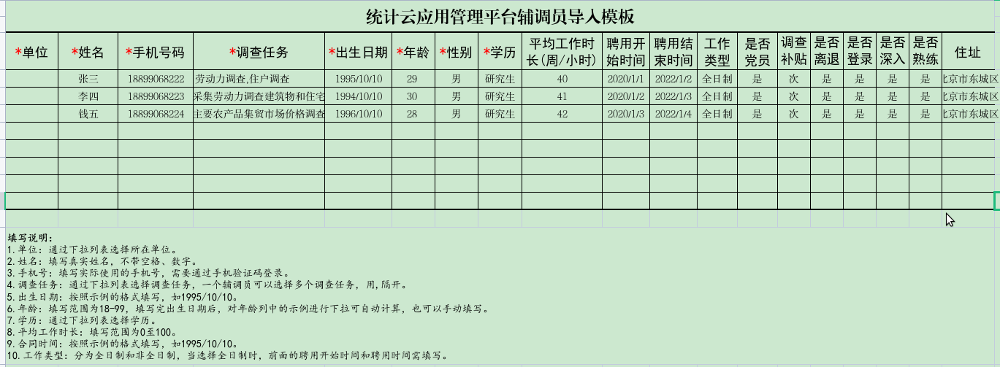

> 图片内容(可检索): 统计云应用管理平台辅调员导人模板
是否
是否
调查
是否
聘用开
聘用结
工作
是否
平均工作时
是否
*单位
*姓名
*年龄
*性别
*手机号码
*调查任务
*出生日期
*学历
深入
补贴
离退
登录
熟练
住址
长(周/小时)
类型
始时间
束时间
党员
2022/1/2
张三
1995/10/10
研究生
40
2020/1/1
全日制
18899068222
劳动力调查，住户调查
29
北京市东城区
李四
18899068223
1994/10/10
30
研究生
41
全日制
采集劳动力调查建筑物和住宅
2020/1/2
2022/1/3
北京市东城区
钱五
全日制
18899068224
1996/10/10
28
研究生
42
2020/1/3
2022/1/4
主要农产品集贸市场价格调查
北京市东城区
填写说明：
1.单位：通过下拉列表选择所在单位。
2.姓名：填写真实姓名，不带空格、数字。
3.手机号：填写实际使用的手机号，需要通过手机验证码登录。
4.调查任务：通过下拉列表选择调查任务，一个辅调员可以选择多个调查任务，用，隔开。
5.出生日期：按照示例的格式填写，如1995/10/10。
6.年龄：填写范国为18-99，填写完出生日期后，对年龄列中的示例进行下拉可自动计算，也可以手动填写。
7.学历：通过下拉列表选择学历。
8.平均工作时长：填写范国为0至100。
9.合同时间：按照示例的格式填写，如1995/10/10。
10.工作类型：分为全日制和非全日制，当选择全日制时，前面的聘用开始时间和聘用时间需填写。

## 第 18 页

**标题**: 导入：选择需要导入的模板，点击导入，调查员列表就会成功增加多条记录。

2.1 调查员管理
图2-8

**备注**: 进入“专用直报平台”后，按照业务流程首先要做的“开网前的准备”工作

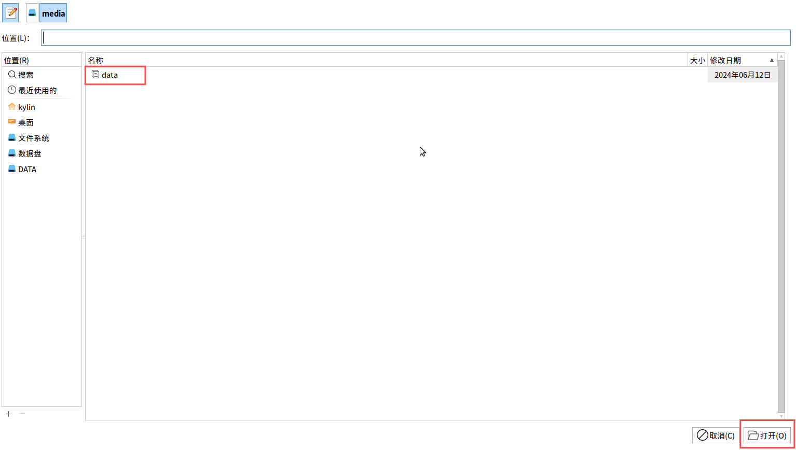

> 图片内容(可检索): media
位置(L):
位置(R)
名称
大小修改日期
Q 搜索
目 data
2024年06月12日
①最近使用的
^ kylin
早桌面
■文件系统
■数据盘
= DATA
①取消(C)
打开(0)

## 第 19 页

**标题**: 二、设置调查员的调查范围：新增调查员后，进入专用直报系统，在任务部署-调查员管理页面就可以看到调查员信息，状态蓝色为启用，灰色为停用，点击调查范围操作按钮。

2.1 调查员管理
图2-9

**备注**: 进入“专用直报平台”后，按照业务流程首先要做的“开网前的准备”工作

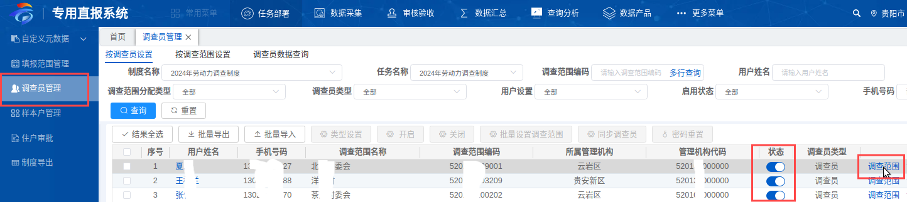

> 图片内容(可检索): 专用直报系统
品 常用菜单
审核验收
数据汇总
查询分析
数据产品
更多菜单
任务部署
数据采集
贵阳市
首页
调查员管理
否自定义元数据
按调查员设置
按调查范围设置
调查员数据查询
雷填报范围管理
制度名称
任务名称
调查范围编码
多行查询
用户姓名
2024年劳动力调查制度
2024年劳动力调查制度
请输入调查范围缩码
请输入用户姓名
&调查员管理
调查员类型
用户设置
启用状态
调查范围分配类型
全部
全部
全部
全部
手机号码
查询
Q:
样本户管理
重置
业批量导出
营开启
结果全选
± 批量导入
e类型设置
关闭
e批量设置调查范围
e同步调查员
住户审批
5 密码重置
序号
用户姓名
手机号码
所属管理机构
管理机构代码
调查范围名称
调查范围编码
状态
调查员类型
围 制度导出
委会
520
云岩区
调查员
27
9001
5201
000000
调查范围
88
贵安新区
130
520
5201:
J3209
J00000
调查员
130.
70
520
云岩区
调查员
00202
5201(
J00000
调查范围

## 第 20 页

**标题**: 点击添加范围，查询调查员所属的调查范围，并保存，调查员即可登录移动统计APP，并适时获取到分配调查范围的调查任务。

2.1 调查员管理
图2-10

**备注**: 进入“专用直报平台”后，按照业务流程首先要做的“开网前的准备”工作

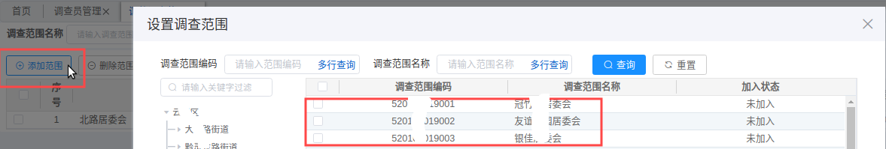

> 图片内容(可检索): 首页
调查员管理×
设置调查范围
调查范围名称
请输入调查范围
调查范围编码
请输入范围编码
多行查询
调查范围名称
请输入范围名称
Q 查询
多行查询
添加范围
删除范围
Q 重置
调查范围编码
调查范围名称
请输入关键学过滤
加入状态
委会
520
19001
冠付
未加入
北路居委会
友谊
居委会
5201
019002
未加入
银佳，#会
5201.
J19003
未加入

## 第 21 页

**标题**: 三、设置指导员：点击设置类型操作，将市州和区县专业人员设置为指导员。

2.1 调查员管理
图2-11

**备注**: 进入“专用直报平台”后，按照业务流程首先要做的“开网前的准备”工作

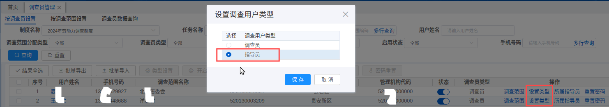

> 图片内容(可检索): 首页
调查员管理×
设置调查用户类型
按调查员设置
按调查范围设置
调查员数据查询
制度名称
任务名称
多行查询
围编码
用户姓名
2024年劳动力调查制度
请输入用户姓名
选择
调查用户类型
启用状态
调查员类型
手机号码
调查范围分配类型
全部
全部
全部
请输入手机号码
调查员
多行查询
Q 查询
重置
指导员
√结果全选
业 批量导出
← 批量导入
e类型设置
5密码重置
保存
取消
序号
状态
用户姓名
手机号码
调查范围名称
管理机构代码
调查员类型
操作
居委会
调查员
13
52
调查范围
设置类型
所属指导员
$29927
000000
重置密码
13
贵安新区
调查员
调查范围
148688
设置类型
所属指导员
520130003209
520
重置密码

## 第 22 页

**标题**: 点击管理调查员，为指导员添加调查员，勾选下辖的调查员并保存，即可在移动统计APP上审批下辖调查员的空户、换户、增户申请。

2.1 调查员管理
图2-12

**备注**: 进入“专用直报平台”后，按照业务流程首先要做的“开网前的准备”工作

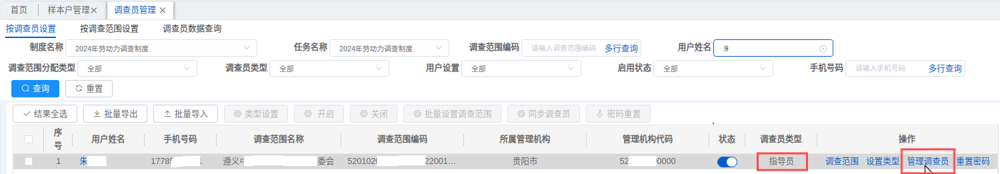

> 图片内容(可检索): 首页
样本户管理×
调查员管理
按调查员设置
按调查范围设置
调查员数据查询
制度名称
任务名称
调查范围编码
多行查询
用户姓名
2024年劳动力调查制度
2024年劳动力码查制度
请输入调查范围编码
调查员类型
用户设置
启用状态
调查范围分配类型
手机号码
全部
全部
全部
全部
请输入手机号码
多行查询
Q 查询
重置
结果全选
业 批量导出
个 批量导入
e类型设置
e 开启
营关闭
e批量设置调查范围
e同步调查员
 密码重置
状态
用户姓名
手机号码
调查范围名称
调查范围编码
所属管理机构
管理机构代码
调查员类型
操作
遵义中
委会
贵阳市
17785
22001..
52
指导员
调查范围
设置类型
管理调查员
5201020
0000
重置密码

## 第 23 页

**标题**: 2.1 调查员管理

图2-13

**备注**: 进入“专用直报平台”后，按照业务流程首先要做的“开网前的准备”工作

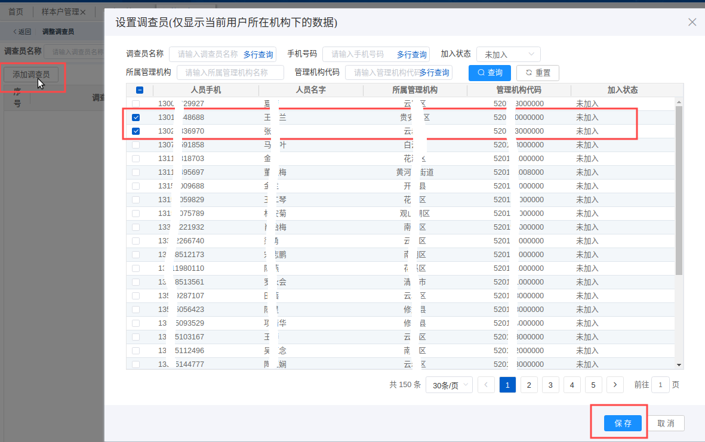

> 图片内容(可检索): 首页
样本户管理×
设置调查员(仅显示当前用户所在机构下的数据)
<返回
调整调查员
调查员名称
请输入调查员名利
调查员名称
请输入调查员名称多行查询
手机号码
多行查询
加入状态
请输入手机号码
未加入
请输入管理机构代码多行查询
所属管理机构
管理机构代码
请输入所属管理机构名称
Q 查询
添加调套员
α重置
所属管理机构
人员手机
人员名字
管理机构代码
加入状态
调查
1300
29927
3000000
520
未加入
贵安
520
1301
48688
0000000
未加入
张一
520
1302
136970
3000000
未加入
1307
i91858
5201
3000000
未加入
1311
:18703
5201
.000000
未加入
1311
黄河
街道
5201
195697
.008000
未加入
131F
5201
000000
J09688
未加入
059829
5201
DOOOOO
131
未加入
131
观L
075789
5201
JOOOOO
未加入
133
台梅
5201
221932
000000
未加入
13:
2266740
5201
000000
未加入
5201
13
8512173
000000
未加入
5201
L1980110
.000000
未加入
13
8513561
5201
.000000
未加入
$287107
5201
:000000
13
未加入
13:
5056423
:000000
5201
未加入
5201
13
5093529
:000000
未加入
13
5103167
520:
3000000
未加入
520:
13
5112496
2000000
未加入
520:
13.
3000000
5144777
未加入
共150条
30条/页
前往
保存
取消

## 第 24 页

**标题**: 四、重置密码：为下辖机构的调查员重置移动统计APP的密码。（重置后初始密码为：Aa.123456）
调查员可以在移动统计APP登录页面点击忘记密码，获取短信验证码重置密码。（发送验证码会提示发送失败，但不用管，会正常收到验证码短信）

2.1 调查员管理
图2-14

**备注**: 进入“专用直报平台”后，按照业务流程首先要做的“开网前的准备”工作

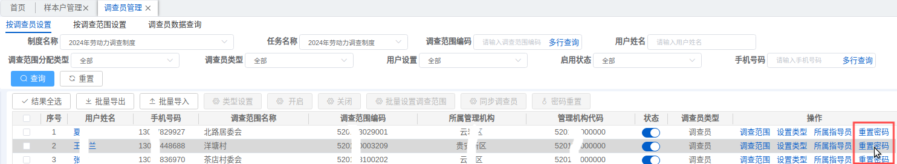

> 图片内容(可检索): 首页
样本户管理×
调查员管理
按调查员设置
按调查范围设置
调查员数据查询
制度名称
任务名称
调查范围编码
请输入调查范围编码
多行查询
2024年劳动力调查制度
用户姓名
2024年劳动力调查制度
请输入用户姓名
调查员类型
用户设置
启用状态
调查范围分配类型
手机号码
全部
全部
全部
全部
请输入手机号码
多行查询
Q 查询
重置
业 批量导出
± 批量导入
e类型设置
e开启
营关闭
结果全选
e 批量设置调查范围
e同步调查员
5 密码重置
序号
状态
用户姓名
手机号码
调查范围名称
调查范围编码
所属管理机构
管理机构代码
调查员类型
操作
北路居委会
13
520.
520.
调查员
调查范围
设置类型
所属指导员
829927
3029001
00000
重置密码
洋塘村
130
448688
520.
贵安区
调查员
调查范围
设置类型
所属指导员
0003209
5201
J00000
重置密码
云区
130
茶店村委会
5201
调查员
调查范围
设置类型
所属指导员
836970
520
3100202
000000
重置密码

## 第 25 页

**标题**: 调查户管理：查询各个报告期内的调查户数据，可暂停轮换社区、更换调查社区等。（功能暂未开放）

2.2 样本户管理
图2-15

**备注**: 接下来看下样本户管理，样本户管理主要包含两大业务模块“调查户管理”和”备选户管理”。
调查户管理中的样本是由运维人员根据我们”制度中的轮换表“在系统进行配置生成的。

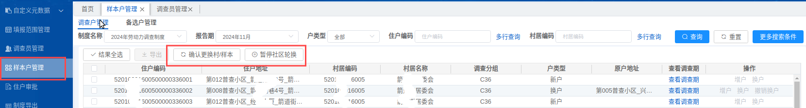

> 图片内容(可检索): 首页
样本户管理
自定义元数据
调查员管理×
调查户管理
备选户管理
雷填报范围管理
制度名称
报告期
户类型
住户编码
村居编码
Q 查询
住户编码
多行查询
村居编码
多行查询
重置
全部
2024年劳动力调否制度
2024年11月
更多搜索条件
调查员管理
结果全选
业 导出
确认更换村/样本
暂停社区轮换
住户编码
村居编码
器样本户管理
村居名称
调查分组
户类型
原户地址
查看调查期
任户地址
操作
第012普查小区箭
委会
新户
增户
号箭..
C36
查看调查期
52017-600500000336001
5201
6005
换户
住户审批
J巷4号_箭..
换户
增户
第008普查小区箭
居委会
第005普查小区兴..
查看调查期
换户
5201
52010
16005
C36
.600500000336002
撤销换户
第012普查小区_经
新户
查看调查期
增户
气箭道街..
5201
16005
5201(
C36
600500000336003
制度导出
换户

## 第 26 页

**标题**: 备选户管理：查询各个社区的剩余备选户数量。（补充备选户功能暂未开放）

2.2 样本户管理
图2-16

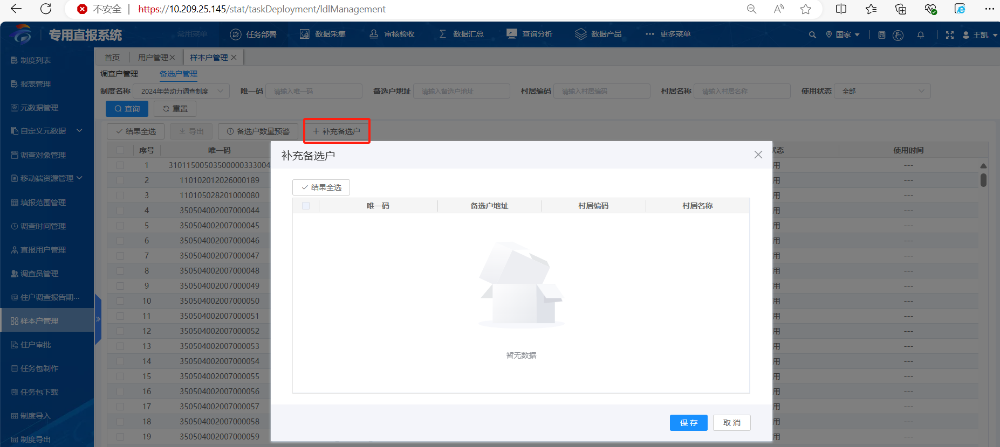

> 图片内容(可检索): 不安全
https://10.209.25.145/stat/taskDeployment/ldManagement
专用直报系统
查询分析
数据产品
数据采集
审核验收
数据汇总
更多菜单
国家
常用菜单
任务部署
王凯
首页
用户管理×
巨 制度列表
样本户管理 ×
调查户管理
备选户管理
巨报表管理
制度名称
村居编码
村居名称
唯一码
请输入唯一码
备选户地址
使用状态
2024年劳动力调查制度
请输入备选户地址
请输入村居编码
请输入村居名称
全部
图元数据管理
Q 查询
2 重置
√结果全选
自定义元数据
业 导出
①备选户数量预警
＋补充备选户
序号
唯一码
补充备选户
使用时间
调查对象管理
31011500503500000333004
回移动端资源管理V
110102012026000189
√结果全选
110105028201000080
留填报范围管理
唯一码
备选户地址
村居编码
村居名称
350504002007000044
350504002007000045
①调查时间管理
350504002007000046
品直报用户管理
350504002007000047
350504002007000048
调查员管理
350504002007000049
国住户调查报告期
10
350504002007000050
11
350504002007000051
品 样本户管理
12
350504002007000052
住户审批
13
350504002007000053
暂无数据
14
350504002007000054
目任务包制作
15
350504002007000055
16
350504002007000056
任务包下载
17
350504002007000057
围 制度导入
18
350504002007000058
保存
取消
19
350504002007000059
围 制度导出

## 第 27 页

**标题**: 【备选户数量预警】：备选户预警值设置，剩余户数查询。设置预警值后，备选户剩余户数低于预警值，则会标记为红色。

2.2 样本户管理
图2-17

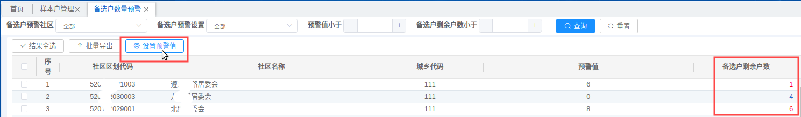

> 图片内容(可检索): 首页
样本户管理×
备选户数量预警
备选户预警社区
备选户预警设置
预警值小于
备选户剩余户数小于
Q 查询
全部
全部
 重置
结果全选
全 批量导出
设置预警值
社区区划代码
社区名称
城乡代码
预警值
备选户剩余户数
52C
客居委会
111
1003
52L
“舍委会
111
2030003
5201
029001
111

## 第 28 页

**标题**: 可按近期备选户使用平均值设置预警值。

2.2 样本户管理
图2-18

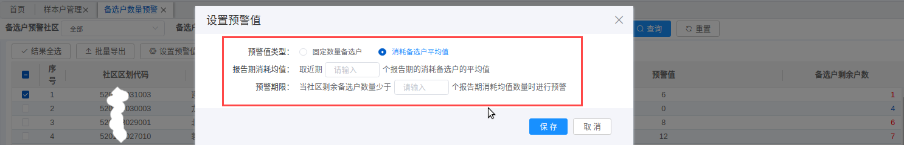

> 图片内容(可检索): 首页
样本户管理×
备选户数量预警×
设置预警值
备选户预警社区
备选户
全部
Q 查询
2 重置
/结果全选
全 批量导出
营设置预警值
预警值类型：
固定数量备选户
消耗备选户平均值
序号
取近期
请输入
报告期消耗均值：
个报告期的消耗备选户的平均值
社区区划代码
预警值
备选户剩余户数
预警期限：
当社区剩余备选户数量少于
请输入
个报告期消耗均值数量时进行预普
526
31003
520
030003
52
3029001
保存
取消
520
12
027010

## 第 29 页

**标题**: 当移动端发起换户、空户申请后，专业人员可审批通过，之后调查员可确定换户、空户、撤销。
仅能审批当月提交的申请，超过报告期无法再次审批超期申请。
审批完成后不再显示审批按钮，换户审批通过后移动端确认后完成换户。
换户、空户申请通常由调查员在移动端进行操作。

2.3 住户审批
注意：平台端的“样本户管理”模块进行的换户、空户操作无需审批，仅移动端需要审批。
图2-19

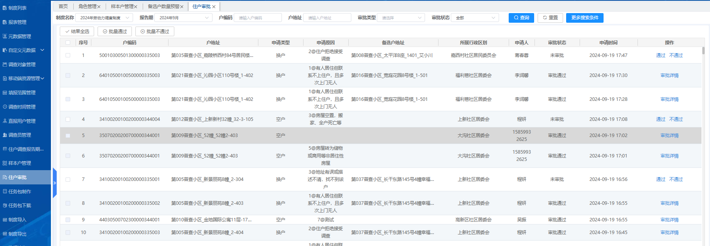

> 图片内容(可检索): 首页
角色管理×
样本户管理X
备选户数量预警×
制度列表
住户审批×
户编码
户地址
审批类型
审批状态
Q. 查询
2024年9月
请输入户地址
全部
制度名称
报告期
2 重置
2024年劳动力调查制度
请输入户编码
更条搜索条件
彭报表管理
√结果全选
批量通过
?批量不通过
 元数据管理
序号
户编码
户地址
申请类型
申请原因
备选户地址
申请人
审批状态
申请时间
所属行政区划
操作
β自定义元数据
2@住户拒绝接受
换户
第035普查小区嘉陵桥西村84号居民楼...
未审批
50010300501300000335003
第008普查小区太平洋B座_1401_艾小川
嘉西村社区居民委员会
蒋春蓉
2024-09-19 17:47
调查
通过  不通过
调查对象管理
1@有人居住但联
换户
64010500100500000335003
第021普查小区沁园小区110号楼1-402
系不上住户，且多
第016普查小区宽庭花园8号楼_1-501
福利巷社区居委会
李润馨
审批通过
2024-09-19 17:30
D移动端资源管理V
审批详情
次上门无人
菌填报范围管理
1@有人居住但联
换户
系不上住户，且条
福利巷社区居委会
64010500100500000335003
李润馨
审批通过
2024-09-19 17:28
第021普查小区沁园小区110号楼1-402
第016普查小区宽庭花园8号楼1-501
审批详情
?调查时间管理
次上门无人
3@房屋空置，搬
空户
程妍
上新社区居委会
34100200100200000344004
第012普查小区_上新新村32幢32-3-105
未审批
2024-09-19 17:08
品直报用户管理
家、全户死亡等
通过  不通过
空户
1585993
调查员管理
大沟社区居委会
审批通过
2024-09-19 17:02
35070200200700000344001
第009普查小区_52幢52幢2-403
审批详情
2625
厨住户调查报告期...
5@房屋转为储物
1585993
空户
大沟社区居委会
审批通过
35070200200700000344001
第009普查小区_52幢52幢2-403
或商用等非居住性
2024-09-19 17:01
审批详情
房屋
2625
品样本户管理
3@地址有误或描
院住户审批
换户
上新社区居委会
程妍
34100200100200000335001
第005普查小区新景丽苑8幢2-304
述不清，找不到该
第037普查小区长干东路145号4幢幸福...
未审批
2024-09-19 16:56
通过   不通过
目任务包制作
1@有人居住但联
换户
上新社区居委会
系不上住户，且条
程妍
34100200100200000335002
第005普查小区新景丽苑8幢2-403
第037普查小区_长干东路145号4幢幸福...
审批通过
2024-09-19 16:55
审批详情
日！任务包下载
次上门无人
空户
高新区社区居委会
7@测试
吴振
审批通过
函制度导入
44030500702300000344001
第010普查小区金地国际公寓11层-17...
2024-09-19 16:55
审批详情
2@住户拒绝接受
程妍
换户
上新社区居委会
10
34100200100200000335003
第005普查小区新景丽苑8幢2-404
第037普查小区长干东路145号4幢幸福...
审批通过
2024-09-19 16:45
围 制度导出
调查
审批详情
@有人居旧联

## 第 30 页

**标题**: 指导员移动端首页
首页主要包括以下功能：展示当前任务，审核空户、换户申请。
另外，点击“调查”按钮还可以查看分配调查范围（一个指导员可以分配多个调查范围）下调查小区的数据采集情况。（因已过了数据填报期，无法获取任务，所以无法进行演示）

2.3 住户审批
图2-20

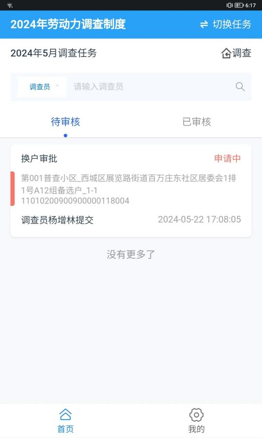

> 图片内容(可检索): 2024年劳动力调查制度
二切换任务
2024年5月调查任务
调查员
请输入调查员
待审核
已审核
换户审批
申请中
第001普查小区_西城区展览路街道百万庄东社区居委会1排
1号A12组备选户_1-1
11010200900900000118004
调查员杨增林提交
2024-05-2217:08:05
没有更多了
首页
我的

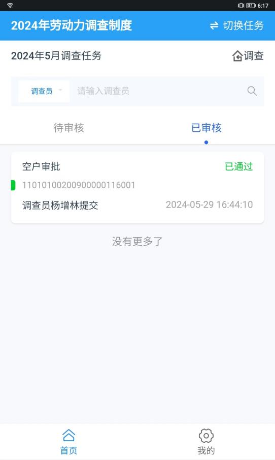

> 图片内容(可检索): 1016:17
2024年劳动力调查制度
=切换任务
2024年5月调查任务
合调查
调查员
请输入调查员
待审核
已审核
空户审批
已通过
11010100200900000116001
调查员杨增林提交
2024-05-2916:44:10
没有更多了
首页
我的

## 第 31 页

**标题**: 01

目录
平台登录
02
任务部署
03
数据采集
04
05
06
审核验收
数据汇总
数据管理

**备注**: 主要介绍内容包含
（1）系统的功能概述（2）开网前准备阶段（3）数据采集（4）审核验收 （5）数据汇总（6）查询分析

## 第 32 页

**标题**: 统计机构录入：专业人员在平台端对辖区内的调查对象进行录入，支持按表、按调查对象两种方式录入。（一般来说不用于数据填报，只作为填报期后的数据修改使用）
调查员录入：调查员使用移动端进行数据的填报。

03 数据采集

**备注**: 采集阶段的录入方式有两种，分别是“统计机构录入”和调查员录入

## 第 33 页

**标题**: 3.1 统计机构录入

图3-1

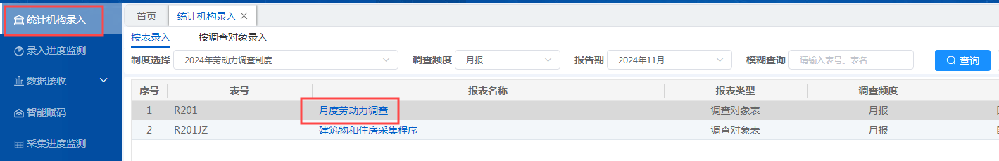

> 图片内容(可检索): 首页
血统计机构录入
统计机构录入X
按表录入
按调对象录入
录入进度监测
调查频度
制度选择
月报
报告期
模糊查询
2024年劳动力调查制度
2024年11月
请入表号、表名
查询
叫数据接收
序号
表号
报表名称
报表类型
调查频度
R201
调香对象表
月度劳动力调音
智能赋码
月报
R201JZ
调香对象表
建筑物和住房采集程序
月报
围采集进度监测

## 第 34 页

**标题**: 在模糊查询输入户编码，可查询需要修改数据的户，并且支持多行查询。

3.1 统计机构录入
图3-2

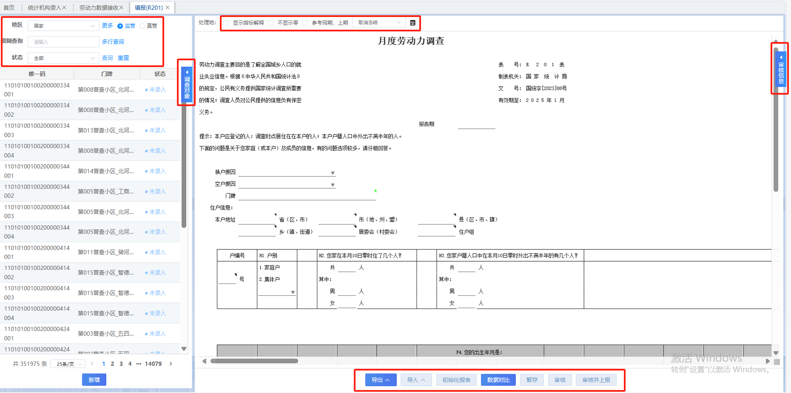

> 图片内容(可检索): 首页
统计机构录入×
劳动力数据接收×
填报(R201)×
处理地：
显示指标解释不显示零参考同期、上期
取消冻结
地区
国家
 监管
○直管
更多
莫糊查询
请输入
多行查询
月度劳动力调查
状态
全部
查询！
重置
●祖查对象
劳动力调查主要目的是了解全国城乡人口的就
号E201表
唯一码
门牌
状态
业失业信息。根据《中华人民共和国统计法》
制表机关：国家统计局
11010100100200000334
的规定，公民有义务提供国家统计调查所需要
第008普查小区_北河..
·未录入
号：国统字[2023]88号
001
的情况；调查人员对公民提供的信息负有保密
有效期至：2025年1月
11010100100200000334
第008普查小区_北河...
·未录入
002
义务。
11010100100200000334
报告期
第013普查小区_北河..
·未录入
003
提示：本户应登记的人：调查时点居住在在本户的人；本户户籍人口中外出不满半年的人。
11010100100200000334
第008普查小区_北河..
·未录入
下面的问题是关于您家庭（或本户）及成员的信息，有的问题选项较多，请仔细回答。
004
11010100100200000344
第014普查小区_北河..
·未录入
换户原因
001
空户原因
11010100100200000344
第005普查小区_工商..
·未录入
002
门牌
11010100100200000344
·未录入
住户信息：
003
第005普查小区_北河..
省(区、市）
市(地、州、盟）
本户地址
县(区、市、旗）
11010100100200000344
·未录入
第005普查小区_北河..
乡 (镇、街道)
居委会（村委会）
住户组
004
11010100100200000414
第011普查小区_骑河..
·未录入
H1.户别
H2.您家在本月10日零时住了几个人？
户编号
001
H3.您家户籍人口中在本月10日零时外出不满半年的有几个人？
1.家庭户
11010100100200000414
第015普查小区_智德.
·未录入
002
2.集体户
其中：
其中：
11010100100200000414
第015普查小区_智德..
·未录入
003
11010100100200000414
第015普查小区智德...
·未录入
004
11010100100200000424
第003普查小区五四..
·未录入
001
11010100100200000424
F4.您的出生年月是：
激活wnaows
共351975条
25条/页
.. 14079
转到"设置"以激活Windows。
数据对比
新增
导入
暂存
审核
初始化报表
审核并上报

## 第 35 页

**标题**: 录入页面中，支持填报过程中各类报表规则，例如：
  填报过程会自动触发计算，以及跳转规则等

录入页面中，提供各类填报辅助功能，方便快捷提高填报效率，例如：
  1.勾选“显示指标解释”后，当光标定位到相应的指标上时会弹出相应的指标解释。
  2.勾选“冻结表头”后，会将报表中的二维表的宾栏冻结，方便填报。
  3.勾选“参考同期、上期”后，当光标定位到相应的指标时，会弹出相应的上期、同期、环比等数据。
  4.点击“暂存”按钮，将填报的数据暂存，但是不审核报表内录入的数据且不上报，为方便下次继续录入。
  5.点击“导出/导入”按钮，可下载模版到本地，填写数据后导入系统。
  6.点击“初始化报表”按钮，数据还未上报则会将表内填报的数据重置，恢复至初始报表状态。
  7.点击“审核”按钮，可审核当前报表内所录入的数据是否满足审核要求，如数据审核出错误则显示审核错误列表，点击审核错误信息可自动定位有问题的指标进行修改。（如遇到审核不通过导致无法验收，需由县级统计调查机构修整数据点击“审核并上报”按钮，然后市级统计调查机构点击“审核”按钮，即可执行验收）
  8.点击“审核并上报”按钮，系统审核后即执行报表数据保存到系统。
3.1 统计机构录入

## 第 36 页

**标题**: 多行查询：复制表格中的户编码，粘贴到多行查询栏（每条户编码为一行），即可多行查询。利用多行查询，可以快捷查询需要批量修改或手动赋码的户。

3.1 统计机构录入
图3-3

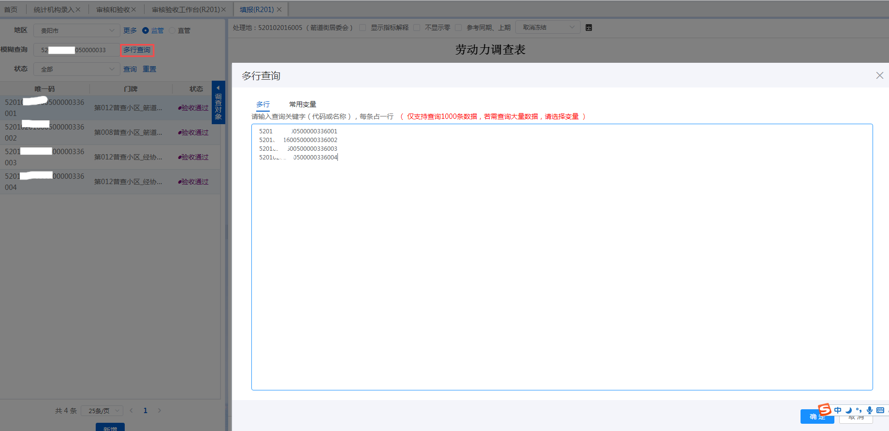

> 图片内容(可检索): 首页
统计机构录入×
审核和验收×
审核验收工作台(R201)×
填报(R201)X
参考同期、上期
取消冻结
处理地：520102016005（箭道街居委会）
显示指标解释
不显示零
地区
○监管
更多
直管
贵阳市
模糊查询
1050000033
多行查询
52
劳动力调查表
状态
全部
查询
重置
多行查询
门牌
唯一码
状态
调查对象
52010
0500000336
多行
第012普查小区_箭道...
●验收通过
常用变量
001
请输入查询关键字（代码或名称），每条占一行（仅支持查询1000条数据，若需查询大量数据，请选择变量）
5201
500000336
●验收通过
5201
第008普查小区_箭道...
J0500000336001
002
5201.
1600500000336002
5201--
00000336
5201
500500000336003
第012普查小区_经协
验收通过
52012--
0500000336004
003
5201
00000336
第012普查小区_经协..
●验收通过
004
共4条
25条/页
中」，圃
确是

## 第 37 页

**标题**: 点击蓝色的“审核信息”按钮，填写审核错误说明（原澄清说明），可在审核信息查询-审核错误清单里批量查看和导出。

3.1 统计机构录入
图3-4

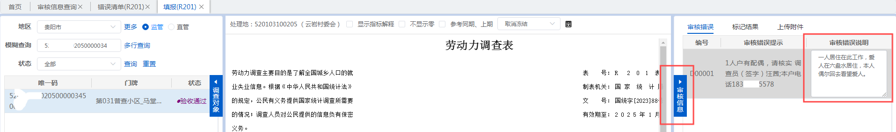

> 图片内容(可检索): 首页
审核信息查询X
错误清单(R201)×
填报(R201)X
显示指标解释
不显示零
参考同期、上期
取消冻结
处理地：520103100205（云岩村委会）
地区
更多
监管
直管
审核错误
标记结果
贵阳市
上传附件
编号
审核错误提示
劳动力调查表
模糊查询
5.
多行查询
2050000034
核错误说明
一人居住在此工作，爱
状态
重置
全部
查询
1人户有配偶，请核实调
人在六盘水居住，本人
号：R
劳动力调查主要目的是了解全国城乡人口的就
１表
00001
音员（签字）汪茜本户电
偶尔旦去看望爱人
唯一码
门牌
状态
话183
制表机关：国家统计
业失业信息。根据中华人民共和国统计法》
5578
调查对象
审核信息
52.
020500000345
验收通过
的规定，公民有义务提供国家统计调查所需要
第031普小区马堂..
文号：国统字[2023]88-
的情况：调查人员对公民提供的信息负有保密
有效期至：2025年1月
义务。

## 第 38 页

**标题**: 数据采集期间，专业人员需监测数据的报送进度情况，对未及时上报的调查对象进行催报。

1.查看数据录入情况，如下图：
点击不同状态下调查对象数，可直接查询到对应状态下的调查对象清单明细。例如：报送率未到100%，应查询未录入的调查对象，点击未上报下的调查对象数，即可查看到未录入的调查对象。
3.2 录入进度监测
图3-5

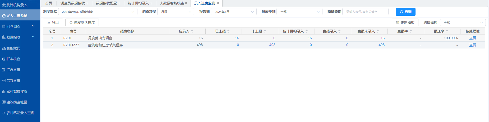

> 图片内容(可检索): 首页
调查员数据接收×
数据接收配置×
统计机构录入×
大数据智能核查X
血统计机构录入
录入进度监测×
报告期
2024年7月
制度选择
调查频度
月报
报表类别
全部
模糊查询
请输入表号/表名关键字
2024年劳动力调查制度
Q 查询
录入进度监测
G 恢复默认排序
定制模板
选择模板
全部
目问卷调查
表号
应录入
已上报
序号
报表名称
未上报
统计机构录入
直报录入
直报未录入
直报率
报送率
按处理地
数据接收
R201
16
16
16
100.00%
月度劳动力调查
查看
498
498
498
R201JZZZ
建筑物和住房采集程序
查看
智能赋码
国样本核查
汇总核查
画音频核查
业农村数据接收
图建议核查社区
Q农村移动录入查询

## 第 39 页

**标题**: 数据接收
调查员先从移动统计APP端导出数据，支持“全部数据”“已审核”数据的导出，将导出的内容在平台端【数据采集】-【第三方数据接收】-【移动数据接收】导入，导入后完成上报。
点击“查看导出文件”跳转到导出文件夹。

3.3 数据接收
图3-6

> 图片内容(可检索): 35:54
<返回
数据导出
系统会对审核通过的数据进行导出，导出地址为：
/storage/emulated/o/Documents/com.thtf.iwzb/export
系统会对所有数据进行导出，导出地址为：
/storage/emulated/o/Documents/com.thtf.lwzb/export
数据导出
查看导出文件

> 图片内容(可检索): 101 [33 5:54
杨增
调查员183
国字体设置
修改密码
数据导出
山日志导出
图帮助文档
5任务初始化
①关于
版本2.8
退出登录
首页
我的

## 第 40 页

**标题**: 3.3 数据接收

图3-7

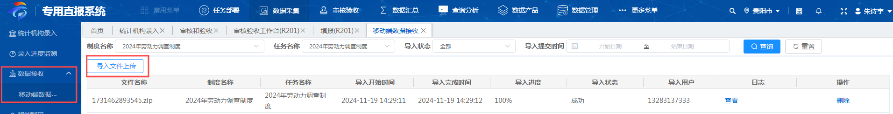

> 图片内容(可检索): 专用直报系统
常用菜单
审核验收
任务部署
数据汇总
查询分析
数据产品
数据管理
更多菜单
数据采集
贵阳市
朱诗宇
首页
统计机构录入×
审核和验收文
审核验收工作台（R201)×
填报(R201)X
查统计机构录入
移动端数据接收X
制度名称
导入状态
任务名称
全部
导入提交时间
2024年劳动力调查制度
2024年劳动力调查制度
开始日期
结束日期
查询
2 重置
录入进度监测
导入文件上传
叫数据接收
文件名称
导入进度
导入状态
导入用户
制度名称
任务名称
导入开始时间
导入完成时间
操作
移动端数据.
1731462893545.zip
2024年劳动力调查制
成功
2024年劳动力调查制度
100%
查看
2024-11-19 14:29:11
2024-11-19 14:29:12
13283137333

## 第 41 页

**标题**: 在数据采集模块，选择“智能赋码”，根据人表信息进行行业、职业进行智能赋码。
操作步骤：选择数据-点击“获取编码”--“确认”--“赋码”，对人表中的行业编码、职业编码指标进行赋码，该功能支持重复确认，赋码，多次操作数据覆盖。

3.4 智能赋码
图3-8

**备注**: 这次测试使用的是大数据的智能赋码，推荐率不是很高，是因为部分填写不规范，触发了负面词。
正式上线后初期会使用杭州的，也就是老平台使用的智能赋码接口。后续会替换成大数据的。
当前的智能赋码和老系统功能类似，前面的显示列是可调的，赋码过程多了一步“确认”操作。

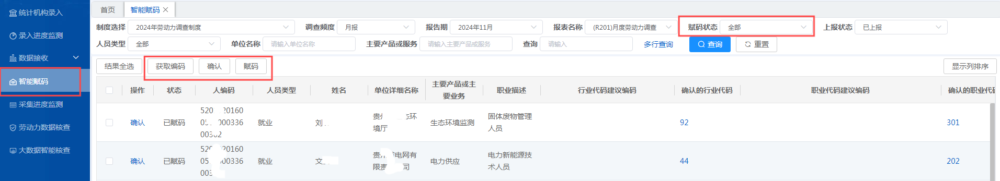

> 图片内容(可检索): 首页
金统计机构录入
智能赋码 X
制度选择
调查频度
月报
报告期
2024年11月
报表名称
赋码状态
全部
上报状态
2024年劳动力调查制度
(R201)月度劳动力调查
已上报
?录入进度监测
查询
Q 查询
人员类型
全部
单位名称
请输入单位名称
请输入
主要产品或服务
请输入主要产品或服务
多行查询
2 重置
业数据接收
获取编码
确认
赋码
结果全选
显示列排序
智能赋码
主要产品或主
操作
状态
人编码
人员类型
姓名
单位详细名称
职业描述
行业代码建议编码
确认的行业代码
职业代码建议编码
确认的职业代动
要业务
围采集进度监测
520
20160
固体废物管理
92
确认
已赋码
000336
生态环境监测
301
?劳动力数据居核香
境厅
人员
0032
52r
国大数据智能核查
20160
网有
电力新能源技
05
44
确认
00336
就业
已赋码
电力供应
202
限责
术人员
003

## 第 42 页

**标题**: 注意事项：
1.因智能赋码功能尚在完善，所以部分需要手动赋码，要注意职业代码不能为整数，如医生，不能简单编为专业技术人员“200”，应编为具体的卫生专业技术人员“205”；
2.因统计云平台可能存在数据保存不稳定的情况，所以已经确认并赋码后，仍会出现行职业编码丢失的情况，因此建议专业人员在数据采集期间每天都对赋码状态为“未确认”和“已确认为赋码”的情况进行查询，并及时重新确认和赋码。（特别是数据采集期的最后一天和上报审核清单时，务必确保所有行职业编码都确认并赋码，否则临时处理可能会出现其他类强制性错误。如11月黔东南原本只有行职业编码类强制性错误，但在25日确保全部确认和赋码后，临时出现了非空户但人表没有数据的情况。）

3.4 智能赋码

**备注**: 这次测试使用的是大数据的智能赋码，推荐率不是很高，是因为部分填写不规范，触发了负面词。
正式上线后初期会使用杭州的，也就是老平台使用的智能赋码接口。后续会替换成大数据的。
当前的智能赋码和老系统功能类似，前面的显示列是可调的，赋码过程多了一步“确认”操作。

## 第 43 页

**标题**: 采集进度监测：可查看上报、验收进度等。支持查看多级进度，点击蓝色箭头，可勾选多级查看。
（需查看并及时提醒开始采集两三天后“已录入”仍为0户的调查点）
关于采集进度监测和录入进度监测数据存在差异的原因：
（1）采集进度监测为劳动力R201表定制功能，实时计算数据。
（2）录入进度检测为系统通用功能，计算时间非实时计算，有延迟。

3.5 采集进度监测
图3-9

**备注**: 这次测试使用的是大数据的智能赋码，推荐率不是很高，是因为部分填写不规范，触发了负面词。
正式上线后初期会使用杭州的，也就是老平台使用的智能赋码接口。后续会替换成大数据的。
当前的智能赋码和老系统功能类似，前面的显示列是可调的，赋码过程多了一步“确认”操作。

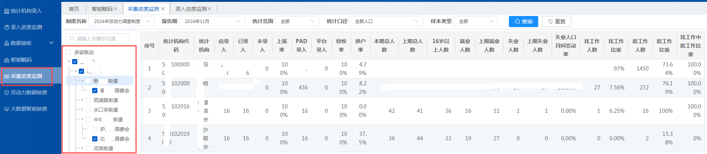

> 图片内容(可检索): 首页
智能赋码×
采集进度监测X
统计机构录入
录入进度监测×
制度名称
报告期
统计范围
全部
统计口径
样本类型
全部
Q 查询
全部人口
2024年劳动力调查制度
2024年11月
2 重置
?录入进度监测
失业人口
请输入关键字过滤
统计
应录
平台
换户
16岁以
找工作中
PAD
就业
找工作
找工作
能工作
统计机构代
已录
未录
上报
验收
本期总人
上期总人
上期就业
失业
上期失业
业数据接收
能工作
序号
月间变动
能工作比
录入
录入
上人数
人数
人数
机构
人数
人数
人数
比重
人数
多级联动
比重
合智能赋码
10
5.
10
4.7
73.6
100000
100.0
.97%
1450
0%
0%
9%
4%
0%
围采集进度监测
新”街道
10
10
8.2
102000
76.1
27
100.0
436
7.56%
居委会
272
0%
0%
2%
9%
?劳动力数据核查
0%
西湖路街道
10
5.
10
102016
0.0
回大数据智能核查
100.0
水口寺街道
16
16
16
42
41
36
16
11
0.00%
6.25%
16
100%
0%
0%
0%
0%
中华
街道
护居委会
10
10
37.
J102019
15.3
16
36
44
33
19
16
16
27
0.00%
0.00%
二居委会
0%
0%
0%
5%
8%
河滨街道

## 第 44 页

**标题**: 替代老平台的数据核查。包含人核查、户核查、社区核查的各类模板，但目前功能尚不完善，核查出的问题不合理。
如人核查-按社区展示，只能看到总的核查情况，无法看到具体情况，也无法导出。

3.6 劳动力数据核查
图3-10

**备注**: 对于查询出的数据的我们可以定位到社区、人、户等，找对应的负责人员进行信息核对。

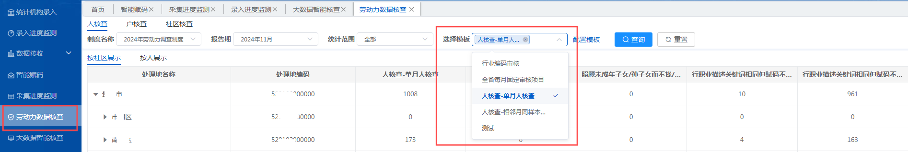

> 图片内容(可检索): 首页
智能赋码×
采集进度监测X
录入进度监测×
大数据智能核查×
劳动力数据核查
盗统计机构录入
人核查
户核查
社区核查
录入进度监测
制度名称
报告期
统计范围
全部
选择模板
Q查询
配置模板
2024年劳动力调查制度
2024年11月
人核查-单月人
2 重置
叫 数据接收
按社区展示
按人展示
行业编码审核
处理地名称
处理地编码
人核查-单月人核查
照顾未成年子女/孙子女而不找...
行职业描述关键词相同但赋码不...
智能赋码
行职业描述关键词相同但码不...
全省每月固定审核项目
5.
700000
1008
10
围采集进度监测
人核查-单月人核查
961
市区
52.
J0000
人核查-相邻月同样本.
劳动力数据居核育
测试
国大数据智能核香
520n7000000
173
163

## 第 45 页

**标题**: 人核查-按人展示，能够导出，但检查规则描述不清楚。

3.6 劳动力数据核查
图3-11

**备注**: 对于查询出的数据的我们可以定位到社区、人、户等，找对应的负责人员进行信息核对。

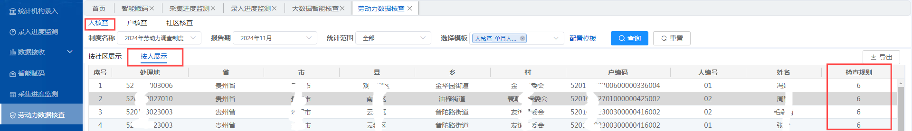

> 图片内容(可检索): 首页
智能赋码×
采集进度监测X
录入进度监测×
大数据智能核查×
劳动力数据核查
统计机构录入
人核查
户核查
社区核查
录入进度监测
制度名称
报告期
统计范围
全部
选择模板
Q 查询
配置模板
2024年11月
2024年劳动力调查制度
人核查-单月人….
2 重置
叫 数据接收
按人展示
按社区展示
用看不
序号
处理地
户编码
人编号
姓名
智能赋码
检查规则
5201
01
003006
贵州省
金华园街道
300600000336004
围采集进度监测
号委会
5201
02
2027010
贵州省
油榨街道
2701000000425002
520*
1委会
5201
02
3023003
贵州省
普陀路街道
300300000416002
劳动力数据核
52
贵州省
5201
07300300000416002
01
23003
普陀路街道
委会

## 第 46 页

**标题**: 户核查-原音频核查，存在异常。

3.6 劳动力数据核查
图3-12

**备注**: 对于查询出的数据的我们可以定位到社区、人、户等，找对应的负责人员进行信息核对。

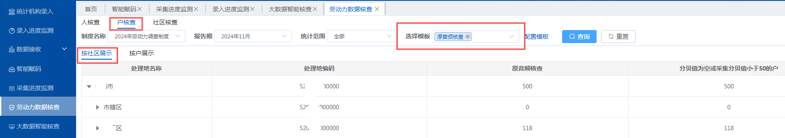

> 图片内容(可检索): 首页
智能赋码×
采集进度监测×
录入进度监测×
大数据智能核查×
劳动力数据核查
统计机构录入
人核查
户核查
社区核查
录入进度监测
统计范围
全部
选择模板
制度名称
报告期
Q 查询
2024年11月
配置模板
2024年劳动力调查制度
原音频核查
2 重置
业数据接收
按社区展示
按户展示
处理地名称
处理地编码
原音频核查
智能赋码
分贝值为空或采集分贝值小于50的户
52
J0000
500
围采集进度监测
500
52n
市辖区
1000000
劳动力数据核查
国大数据智能核香
52L
J00000
118
118

## 第 47 页

**标题**: 社区核查-无法获取GPS大于等于10户的社区，存在异常。

3.6 劳动力数据核查
图3-13

**备注**: 对于查询出的数据的我们可以定位到社区、人、户等，找对应的负责人员进行信息核对。

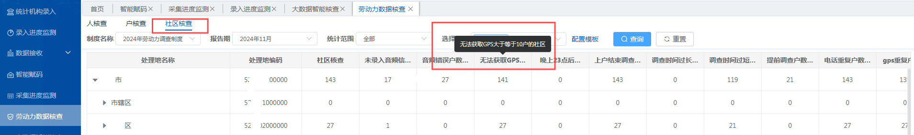

> 图片内容(可检索): 首页
智能赋码X
采集进度监测X
录入进度监测×
大数据智能核查×
劳动力数据核查
盗统计机构录入
人核查
户核查
社区核查
录入进度监测
制度名称
报告期
统计范围
全部
选择
2024年11月
配置模板
查询
2024年劳动力调查制度
Q 重置
无法获取GPS大于等于10户的社区
叫数据接收
社区核查
处理地名称
处理地编码
未录入音频信.
音频错误户数...
无法获取GPS...
晚上23点后...
上户结束调查..
调查时间过长...
调查时间过短...
提前调查户数...
电话重复户数...
gps重复月
智能赋码
5.
143
17
27
141
143
119
21
143
00000
13
围采集进度监测
市辖区
1000000
劳动力数据核查
52
27
27
21
J2000000
27

## 第 48 页

**标题**: 功能仍在开发中，但从功能描述看，有备注说明审核、调查行为异常监测、指标对比异常监测和自定义监测任务，成功上线后预计会对审核有很大帮助。

3.7 大数据智能核查
图3-14

**备注**: 对于查询出的数据的我们可以定位到社区、人、户等，找对应的负责人员进行信息核对。

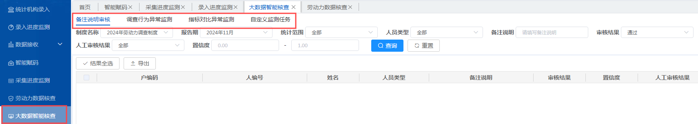

> 图片内容(可检索): 首页
智能赋码×
采集进度监测X
录入进度监测X
大数据智能核查
统计机构录入
劳动力数据核查×
备注说明审核
调查行为异常监测
指标对比异常监测
自定义监测任务
录入进度监测
报告期
统计范围
人员类型
全部
备注说明
审核结果
制度名称
2024年劳动力调查制度
2024年11月
全部
请填写备注说明
通过
业 数据接收
人工审核结果
全部
置信度
Q查询
0.00
1.00
重置
智能赋码
结果全选
全 导出
户编码
人编号
姓名
人员类型
备注说明
审核结果
置信度
围采集进度监测
人工审核结果
劳动力数据核查
四大数据智能核香

## 第 49 页

**标题**: 01

目录
平台登录
02
任务部署
03
数据采集
04
05
06
审核验收
数据汇总
数据管理

**备注**: 主要介绍内容包含
（1）系统的功能概述（2）开网前准备阶段（3）数据采集（4）审核验收 （5）数据汇总（6）查询分析

## 第 50 页

**标题**: 审核公式已经由国家进行配置，在调查对象填写统计报表上报时，会自动触发审核，也可手动批量执行审核：勾选R201表，点击“立即执行”按钮。（建议上报审核清单和进行数据验收时，手动提交一次公式审核，对所有数据进行一次审核，避免还有强制性错误）

4.1 公式审核和配置
图4-1

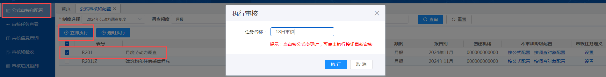

> 图片内容(可检索): 首页
函公式审核和配置
公式审核和配置×
执行审核
制度选择
月报
Q 查询
2024年劳动力调查制度
调查频度
G重置
审核任务查看
任务名称：
①立即执行
定时执行
18日审核
审核信息香询
频度
报告期
创建机构
不审和降级配置
提示：当审核公式变更时，可点击执行按钮重新审核
审核任务定义
审核和验收
月报
R201
2024年11月
月度劳动力调香
Q00000000000
按公式配置
按调查对象配置
设置
月报
2024年11月
R201/Z
000000000000
按公式配置
按调香对象配置
建筑物利口住房采集程序
设置
执行
函审核进度监测
取消

## 第 51 页

**标题**: 查看提交的审核任务执行情况。

4.2 审核任务查看
图4-2

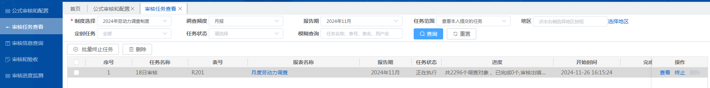

> 图片内容(可检索): 首页
公式审核和配置×
围公式审核和配置
审核任务查看×
调查频度
月报
报告期
制度选择
任务范围
查看本人提交的任务
2024年劳动力调查制度
2024年11月
点击右侧选择地区按钮
选择地区
，审核任务查看
请选择
模糊查询
Q查询
定时任务
全部
任务状态
任务名称、表号、表名、用户名
Q 重置
审核信息香询
批量终止任务
回删除
审核和验收
序号
表号
报表名称
报告期
进度
任务名称
任务状态
开始时间
操作
18日审核
R201
查看
终止
月度劳动力调香
2024年11月
正在执行
共2296个调音对象，已完成0个审核出错.
2024-11-26 16:15:24
函审核进度监测
删除

## 第 52 页

**标题**: 可以查看具体每张报表审核错误情况，可以按地区统计、按错误统计，主要是进行对审核错误清单进行查看和处理。如下图：

4.3 审核信息查询
图4-3

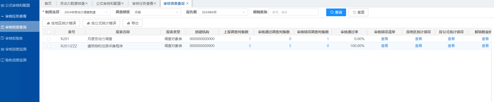

> 图片内容(可检索): 首页
劳动力数据核查X
公式审核和配置X
审核任务查看X
国公式审核和配置
审核信息查询X
*制度选择
调查频度
报告期
2024年8月
模糊查询
月报
表号、表名
Q查询
2024年劳动力调查制度
G 重置
+审核任务查看
山 按地区统计错误
山 按公式统计错误
Ⅱ审核信息查询
表号
报表名称
报表类型
创建机构
上报调查对象数
审核通过调查对象数
审核错误调查对象数
审核通过率
审核错误清单
按地区统计错误
按公式统计错误
解锁数量络
审核和验收
R201
月度劳动力调查
调查对象表
000000000000
0.00%
查看
查看
查看
查看
查看
调查对象表
000000000000
100.00%
查看
查看
建筑物和住房采集程序
R201JZZZ
查看
围审核进度监测
验收进度监测

## 第 53 页

**标题**: 按审核公式类别查看错误、对审核错误进行批量核实确认，统计机构录入里填写的审核错误说明可以在此处批量查看和导出。

4.3 审核信息查询
图4-4

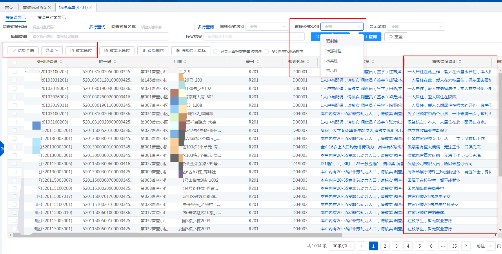

> 图片内容(可检索): 首页
审核信息查询×
错误清单(R201)×
按错误显示
按调查对象显示
调查对象代码
多行查询
审核公式级别
全部
审核公式类别
全部
显示范围
多行查询
调查对象代码
调查对象名称
调查对象名称
全部
模糊查询
核实结果
请选择核实结果
错误提示信息。审核错误说明
查询
2 重置
强制性
√结果全选
核实通过
 核实不通过
 取消排序
幸 选择显示指标
只显示直报数据审核错误
多列排序/取消排序
准强制性
门牌
唯一码
处理地编码令
表号
核实性
审核错误说明→
＇ 2-9
D00001
第031普查小F
R201
520103100205)
52010310020500000345...
提示性
员（签字）汪茜;本
一人居住在此工作，爱人在六盘水居住，本人倡
20103031201)
52010303120100000425..
20号_203
R201
第145普查小
D00001
1人户有配偶，请核实调查员（签字）成瑶;本）
一人居住在此，爱人在六枝居住，偶尔回去看望
20103019003)
52010301900300000336...
180号_2#102
R201
第021普查小区
D00001
1人户有配偶，请核实调查员（签字）田蓓;本）
一人居住，爱人在老家居住，本人有空会返回老
52010302600200000416...
号京苑大厦_603
20103026002)
第001普查小区
R201
D00001
1人户有配偶，请核实调查员（签字）梁勇;本
一人居住，爱人居住在陕西。
20103019011)
52010301901100000345...
3_1208
R201
第007普查小区
D00001
1人户有配偶，请核实调查员（签字）陶亚娴；
一人居住，爱人长期居住在师大的另外一套房子
20103100204)
5201031002040000033...
地132_耀国琴
第034普查小区
R201
D04003
本户内有20-55岁非劳动力人口，请核实调查
为了照顾家中两个小孩，一个未满一岁，暂时无
远祥自建房_大赛...
R201
20103100209)
52010310020900000425...
第009普查小区
D00001
1人户有配偶，请核实调查员（签字）张才红;
仅经核实，本人一人居住在此，配偶在老家。
第022普查小区
247号4号楼-贵州...
R201
(520115005201)
52011500520100000336...
D90007
高职、大学专科毕业年龄过大,请核实f9和f9.1
休学导致毕业年龄偏大
52013000300100000345...
A1新楼3个单元..
R201
(520130003001)
第005普查小区
D04003
本户内有20-55岁非劳动力人口，请核实调查
何琴在家照顾女儿生活、上学，没有找工作
(520130003001)
R201
52013000300100000345...
第001普查小区
D04002
区103栋3个单元高...
全户16岁上人口均为非劳动力，其中有60岁以
侯斌患有重大疾病，无法工作，低保兜底
52013000300100000345...
第001普查小区
区103栋3个单元_高...
R201
D04003
(520130003001)
本户内有20-55岁非劳动力人口，请核实调查
侯斌患有重大疾病，无法工作，低保兜底
(520115003006)
52011500300600000416...
第027普查小区
委会金朱东路399号...
R201
D19002
f21选1、2、3时，f23一般应选1，请核实调章
保险公司兼职人员，所以未签订合同
(520130003001)
52013000300100000425...
第009普查小
区6区A7栋_高峰社..
R201
D04003
本户内有20-55岁非劳动力人口，请核实调查
周泽琴属于特殊工种提前退休，有退休金，身体
(520115003007)
52011500300700000345...
第003普查小区
[号山临境3栋_1002
R201
D04003
本户内有20-55岁非劳动力人口，请核实调查
因属于在校学生，暂不能就业
区(520115100200)
52011510020000000425...
第008普查小
且4号刘齐发_何官...
R201
D04003
本户内有20-55岁非劳动力人口，请核实调查
因患脑出血在康养中
52011500701700000425...
R201
D04003
区(520115007017)
第025普查小
示社区兴筑西路88...
本户内有20-55岁非劳动力人口，请核实调查
在家照顾2个未成年子女
52011510020100000345...
区(520115100201)
第028普查小区
R201
D04003
号张兴秀_金华村二...
本户内有20-55岁非劳动力人口，请核实调查
在家照顾2个未成年的孙子女
区(520115006010)
52011500601000000336...
R201
D04003
第017普查小[
路6号龙慧苑10栋_2...
本户内有20-55岁非劳动力人口，请核实调查
在家照顾待产的老婆。
明区(520115005001)
52011500500100000425...
R201
第032普查小
园5栋_5栋2003
D04003
本户内有20-55岁非劳动力人口，请核实调查
在校学生，暂无就业意愿
胡区(520115005001)
52011500500100000425...
第032普查小
爱园5栋_5栋2003
R201
D04003
本户内有20-55岁非劳动力人口，请核实调查
在校学生，哲无就业意愿
30条/页
35
共1034条
前往

## 第 54 页

**标题**: 进行数据审核和验收，可按验收状态查询、按指标查询、按过滤条件查询、按模板等查询。

4.4 审核和验收
图4-5

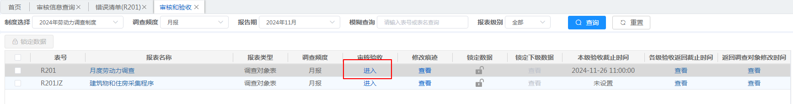

> 图片内容(可检索): 首页
审核信息香询×
错误清单(R201)X
审核和验收
月报
报告期
制度选择
调查频度
2024年11月
模糊查询
请入表号或表名查询
报表级别
全部
查询
2024年劳动力调查制度
重置
锁定数据
表号
报表名称
报表类型
调查频度
重核验收
修改痕迹
锁定数据
各级验收返回截止正时间
锁定级据
本级验收截正时间
返回调查对象修改时间
进入
R201
月报
查看
查看
查看
月度劳动力调查
调查对象表
2024-11-26 11:00:00
查看
月报
进入
查看
R201JZ
查看
查看
未设置
调查对象表
建筑物利和口住房采集程序
查看

> 图片内容(可检索): 首页
劳动力数据核查×公式审核和配置×
审核任务查看×审核信息查询×
审核和验收×
审核验收工作台(R201JZZZ)×
报表选择
报表类别
报告期
2024年8月
上报级别
全部
验收状态
(R201JZZZ)建筑物和住房采集程序
请选择专业
请设置各级验收状态
业务状态
IP查询
查询区
建筑物唯一码
编辑过滤条件
指标查询
列表
初次上报
点击设置多行查询条件
过滤条件
开始时间 ---结束时
增加条件
表样查询
智能审核
模板查询
全部
查询
请选择查询模板
公式查询
请选择审核公式
标记查询
重置
请选择标记
模板管理
保存模板
录入范围
直管
监管
结果全选
逐个验收
白验收通过
 验收不通过
C? 取消返回修改
日标记
P 标记下发
血删除标记
园计算匹导出结果
指标模板
D快速汇总
多列排序/取消排序
 设置显示指标
更多
返回调查对象
返回级别
国家验收状态
分组
功能区
国家级验收说明
地区
查看 往期
天津市(120110005006)
12011000500600001
马鞍池东路95号
国家
查看
往期
天津市(120110005006)
120110005006103
建筑物103
北京市
查看
往期
天津市(120110005006)
120110005006105
天津市
建筑物105
往期
天津市(120110005006)
120110005006116
查看
河北省
建筑物116
山西省
查看 往期
天津市(120110005006)
120110005006240
建筑物240
内蒙古自治区
辽宁省
吉林省
黑龙江省
上海市
江苏省
列表区
浙江省
安徽省
福建省
江西省
山东省
河南省
湖北省
湖南省
广东省
广西壮族自治区
海南省
重庆市
四川省
贵州省
云南省

## 第 55 页

**标题**: 进行数据审核和验收，可按验收状态查询、按指标查询、按过滤条件查询、按模板查询、按公式查询和按标记查询。

4.4 审核和验收
图4-5

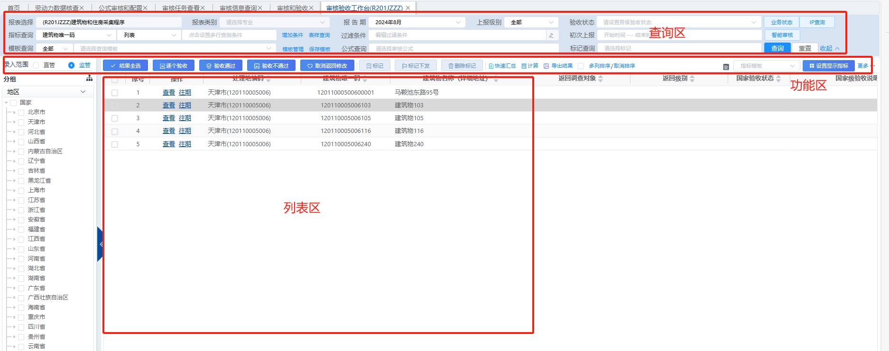

> 图片内容(可检索): 首页
劳动力数据核查×公式审核和配置×
审核任务查看×审核信息查询×
审核和验收×
审核验收工作台(R201JZZZ)×
报表选择
报表类别
报告期
2024年8月
上报级别
全部
验收状态
(R201JZZZ)建筑物和住房采集程序
请选择专业
请设置各级验收状态
业务状态
IP查询
查询区
建筑物唯一码
编辑过滤条件
指标查询
列表
初次上报
点击设置多行查询条件
过滤条件
开始时间 ---结束时
增加条件
表样查询
智能审核
模板查询
全部
查询
请选择查询模板
公式查询
请选择审核公式
标记查询
重置
请选择标记
模板管理
保存模板
录入范围
直管
监管
结果全选
逐个验收
白验收通过
 验收不通过
C? 取消返回修改
日标记
P 标记下发
血删除标记
园计算匹导出结果
指标模板
D快速汇总
多列排序/取消排序
 设置显示指标
更多
返回调查对象
返回级别
国家验收状态
分组
功能区
国家级验收说明
地区
查看 往期
天津市(120110005006)
12011000500600001
马鞍池东路95号
国家
查看
往期
天津市(120110005006)
120110005006103
建筑物103
北京市
查看
往期
天津市(120110005006)
120110005006105
天津市
建筑物105
往期
天津市(120110005006)
120110005006116
查看
河北省
建筑物116
山西省
查看 往期
天津市(120110005006)
120110005006240
建筑物240
内蒙古自治区
辽宁省
吉林省
黑龙江省
上海市
江苏省
列表区
浙江省
安徽省
福建省
江西省
山东省
河南省
湖北省
湖南省
广东省
广西壮族自治区
海南省
重庆市
四川省
贵州省
云南省

## 第 56 页

**标题**: 按验收状态查询:

4.4 审核和验收
图4-6

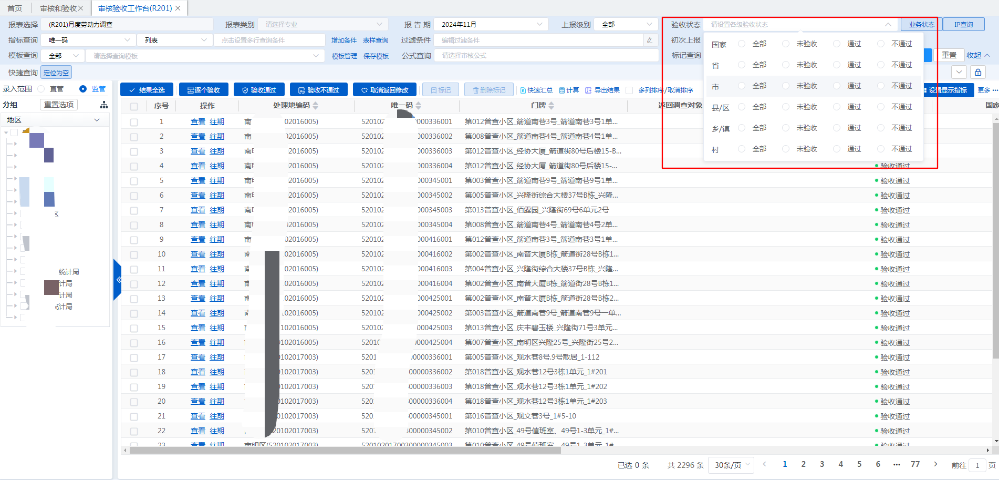

> 图片内容(可检索): 首页
审核和验收×
审核验收工作台(R201)×
2024年11月
全部
请设置各级验收状态
报表选择
报表类别
请选择专业
报告期
上报级别
验收状态
业务状态
(R201)月度劳动力调查
IP查询
指标查询
唯一码
过滤条件
列表
编辑过滤条件
点击设置多行查询条件
增加条件 表样查询
初次上报
全部
未验收
通过
国家
不通过
标记查询
模板查询
重置
全部
公式查询
请选择审核公式
请选择查询模板
模板管理
保存模板
收起^
未验收
通过
不通过
快捷查询
定位为空
全部
未验收
通过
录入范围
直管
结果全选
验收通过
日标记
不通过
吕逐个验收
 验收不通过
血 删除标记
多列排序/取消排序
: 设置显示指标
G 取消返回修改
目快速汇总 园计算 匹 导出结果
分组
唯一码
重置选项
处理地编码
序号
操作
返回调查对象
全部
通过
县/区
未验收
不通过
国家
地区
查看 往期
02016005)
520102
000336001
第012普查小区_箭道南巷3号_箭道南巷3号1单..
未验收
通过
乡/镇
不通过
往期
查看
(2016005)
520102
J00336002
第008普查小区_箭道南巷4号_箭道南巷4号1单...
全部
未验收
2016005)
300336003
往期
520102
第012普查小区_经协大厦_箭道街80号后楼15-B..
不通过
2016005)
查看
往期
520102
300336004
第012普查小区_经协大厦箭道街80号后楼15-..
·验收通过
2016005)
往期
520102
00345001
第003普查小区_箭道南巷9号_箭道南巷9号1单..
·验收通过
往期
2016005)
520102
J00345002
第005普查小区_兴隆街综合大楼37号B栋_兴隆...
·验收通过
往期
2016005)
520102
第013普查小区_佰露园_兴隆街69号6单元2号
00345003
[风
·验收通过
520102
往期
(2016005)
300345004
第008普查小区_箭道南巷4号_箭道南巷4号2单...
·验收通过
02016005)
往期
520102
300416001
第012普查小区_箭道南巷3号_箭道南巷3号1单..
·验收通过
10
往期
.02016005)
520102
查看
300416002
第002普查小区_南普大厦B栋_箭道街28号B栋1...
·验收通过
往期
查看
.02016005)
520102
300416003
第004普查小区_兴隆街综合大楼37号B栋_兴隆...
统计局
·验收通过
.02016005)
12
520102
300416004
查看
往期
第002普查小区_南普大厦B栋_箭道街28号B栋1...
计局
·验收通过
计局
13
查看
往期
.02016005)
520102
J00425001
第002普查小区_南普大厦B栋_箭道街28号B栋2...
·验收通过
心计局
14
往期
L02016005)
520102
300425002
查看
第003普查小区_箭道南巷9号_箭道南巷9号一单...
·验收通过
15
查看
往期
102016005)
520102
000425003
第013普查小区_庆丰碧玉楼_兴隆街71号3单元...
·验收通过
16
往期
102016005)
5201
J000425004
第007普查小区_南明区兴隆25号_兴隆街25号2...
·验收通过
17
往期
102017003)
5201
J0000336001
第005普查小区_观水巷8号.9号散居_1-112
·验收通过
18
102017003)
往期
5201
00000336002
第018普查小区_观水巷12号3栋1单元_1#201
查看
·验收通过
往期
102017003)
19
查看
520:
00000336003
第018普查小区_观水巷12号3栋1单元_1#202
·验收通过
20
往期
查看
102017003)
520
第018查小区_观水巷12号3栋1单元_1#203
00000336004
·验收通过
21
往期
520:
查看
0102017003)
00000345001
第016普查小区_观文巷3号_1#5-10
·验收通过
22
往期
20102017003)
5201
300000345002
第010普查小区_49号值班室、49号1-3单元_1#...
·验收通过
等010普查小区M0旦值班会
40旦12单元1#
共2296条
30条/页
已选０条
77
前往

## 第 57 页

**标题**: 4.4 审核和验收

图4-7
按过滤条件查询可自行编辑查询条件，如查询填报日期早于10号的数据：双击调查表内填报日期的“日”指标，选择运算符“<小于”，输入数字“10”，点击验证，校验成功后即可确定查询。

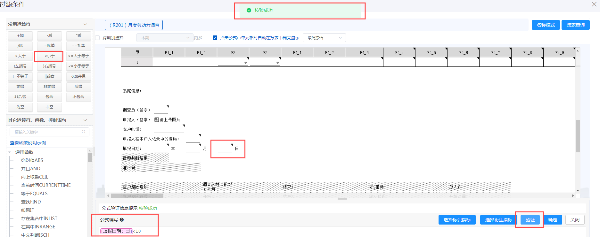

> 图片内容(可检索): 过滤条件
校验成功
常用运算符
名称模式
（R201）月度劳动力调查
跨表查询
-减
+加
*乘
跨期别选择
本期
更多
点击公式中单元格时自动在报表中高亮显示
取消冻结
/除
=赋值
==相等
F1_1
F1_2
F4_1
F4_2
F4_3
F4_4
F4_5
F4_6
F4_7
F4_8
F2
F3
F4_9
≤小于
>大于
>=大于等于
(左括号
≤=小于等于
)右括号
!=不等于
&&并且
前缀
非前缀
后缀
表尾信息：
非后缀
包含
不包含
为空
非空
调查员（签字）
申报人（签字）
其它运算符、函数、控制语句
回请上传图片
请输入关键字
本户电话：
申报人在本户人记录中的编码：
查看函数说明示例
填报日期：
通用函数
绝对值ABS
音频判断结果
并且AND
唯一妈
向上取整CEIL
当前时间CURRENTTIME
空户原因选项
调查次数（轮次
结束1
GPS坐标
2本月
总人数
等于EQUALS
查找FIND
如果IF
公式验证信息提示校验成功
存在集合中INLIST
公式编写 ○
选择行生指标
验证
选择标识指标
确定
关闭
在其中INRANGE
[填报日期：日]k10
中文判断ISCH

## 第 58 页

**标题**: 4.4 审核和验收

图4-8
过滤查询结果

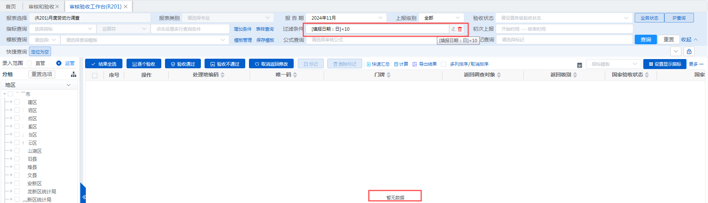

> 图片内容(可检索): 首页
审核和验收×
审核验收工作台(R201)×
报表选择
报告期
上报级别
全部
报表类别
请选择专业
2024年11月
验收状态
请设置各级验收状态
业务状态
(R201)月度劳动力调查
IP查询
选择指标
过滤条件
[填报日期：日]10
初次上报
指标查询
增加条件
表样查询
点击设置多行查询条件
开始时间 --- 结束时间
模板查询
请选择
请选择标记
查询
重置
请选择查询模板
公式查询
请选择审核公式
[填报日期：日]<10记查询
模板管理
保存模板
收起
快捷查询
定位为空
录入范围
直管
监管
结果全选
吕逐个验收
 验收不通过
G 取消返回修改
日标记
血 删除标记
指标模板
白 验收通过
围计算 匹 导出结果
目快速汇总
多列排序/取消排序
 设置显示指标
更多
分组
重置选项
门牌
返回调查对象
唯一码
序号
操作
处理地编码
返回级别 
国家验收状态一
国家
地区
辖区
岩区
当区
云区
山湖区
阳县
烽县
文县
安新区
龙新区统计局
-新区统计局
暂无数据

## 第 59 页

**标题**: 4.4 审核和验收

图4-9
设置好的过滤条件，还可以保存为模板，方便下次使用。

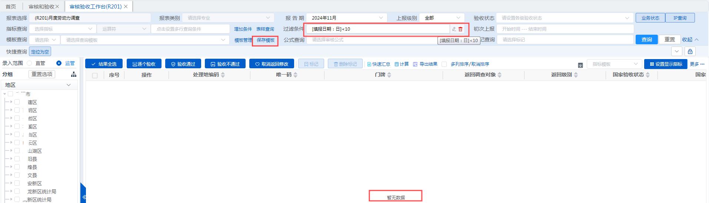

> 图片内容(可检索): 首页
审核和验收×
审核验收工作台(R201)×
报表选择
报告期
上报级别
全部
报表类别
请选择专业
2024年11月
验收状态
请设置各级验收状态
业务状态
(R201)月度劳动力调查
IP查询
选择指标
过滤条件
初次上报
指标查询
[填报日期：日]10
点击设置多行查询条件
增加条件
表样查询
开始时间 --- 结束时间
模板查询
请选择
保存模板
请选择标记
查询
重置
请选择查询模板
公式查询
模板管理
请选择审核公式
[填报日期：日]<10记查询
收起
快捷查询
定位为空
录入范围
直管
监管
结果全选
G取消返回修改
吕逐个验收
 验收不通过
日标记
血 删除标记
指标模板
白 验收通过
围计算 匹 导出结果
目快速汇总
多列排序/取消排序
 设置显示指标
更多
分组
重置选项
门牌
返回调查对象
唯一码
序号
操作
处理地编码
返回级别 
国家验收状态一
国家
地区
辖区
岩区
当区
云区
山湖区
阳县
烽县
文县
安新区
龙新区统计局
-新区统计局
暂无数据

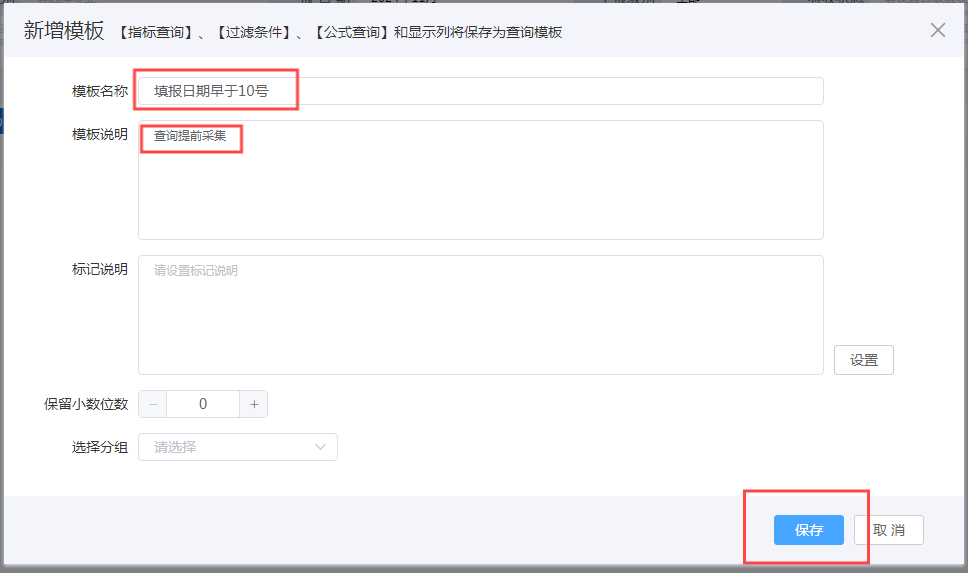

> 图片内容(可检索): 新增模板
【指标查询】、【过滤条件】、【公式查询】和显示列将保存为查询模板
模板名称
填报日期早于10号
模板说明
查询提前采集
标记说明
请设置标记说明
设置
保留小数位数
选择分组
请选择
保存
取消

## 第 60 页

**标题**: 4.4 审核和验收

图4-10
按模板查询，国家已创建大量模板，专业人员在数据审核时应多次查询国家模板，如有错误及时修正。
（还可以将模板增加快捷按钮，方便点击）

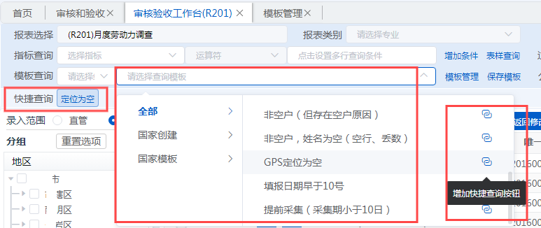

> 图片内容(可检索): 首页
审核和验收X
审核验收工作台（R201)
模板管理X
报表选择
报表类别
(R201)月度劳动力调查
请选择专业
选择指标
指标查询
运算符
增加条件
点击设置多行查询条件
表样查询
模板查询
请选择
请选择查询模板
模板管理
保存模板
快捷查询
定位为空
全部
非空户（但存在空户原因）
录入范围
直管
返回修
国家创建
非空户，姓名为空（空行、丢数）
分组
重置选项
地区
国家模板
GPS定位为空
:01500
填报日期早于10号
500
增加快捷查询按钮
500
提前采集（采集期小于10日）
岩区
101600

## 第 61 页

**标题**: 4.4 审核和验收

图4-11
本级设置的模板，可以设置共享地区，共享给下级机构。

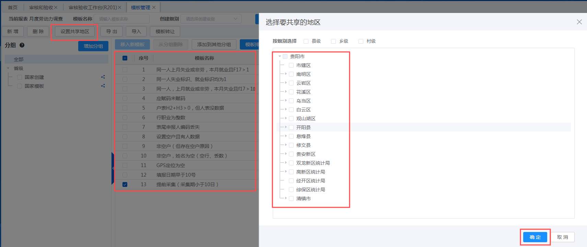

> 图片内容(可检索): 审核验收工作台(R201)X
首页
审核和验收×
模板管理×
当前报表 月度劳动力调查
模板名称
创建级别
请输入模板名称
请选择创建级别
选择要共享的地区
新增
删除
设置共享地区
导出
导入
模板转让
按级别选择
县级
乡级
模板排
添加到其他分组
村级
移入新模板
增加分组
从分组删除
模板名称
序号
贵阳市
全部
省级
市辖区
同一人上月失业或非劳，本月就业且F17>1
国家创建
南明区
同一人失业标识、就业标识均为1
国家模板
云岩区
同一人，上月就业或非劳，本月失业且f17>1自
花溪区
应赋码未赋码
乌当区
户表H2+H3>0，但人表没数据
白云区
行职业为整数
观山湖区
表尾申报人编码丢失
开阳县
设置空户且有人数据
息烽县
非空户（但存在空户原因）
修文县
10
非空户，姓名为空（空行、丢数）
贵安新区
11
GPS定位为空
双龙新区统计局
12
填报日期早于10号
高新区统计局
13
经开区统计局
提前采集（采集期小于10日）
综保区统计局
清镇市
确定
取消

## 第 62 页

**标题**: 4.4 审核和验收

数据问题：为什么有的空户有户表、人表数据？
问题原因：先非空户上报数据，又申请空户后未再次上报导致，重新上报即可。
数据问题：为什么有时候统计机构录入和审核验收看到的数据不一致？
审核验收看到的数据是上报后入库的数据，统计机构录入的数据是根据已填写数据和实时执行填报规则（按顺序执行）后的结果，若不一致，可重新上报，上报后审核验收数据则和统计机构录入数据保持一致。

## 第 63 页

**标题**: 4.4 审核和验收

图4-12
数据验收：勾选需要验收的数据，可以批量“验收通过”或逐个验收，验收后可以查看本级验收状态。

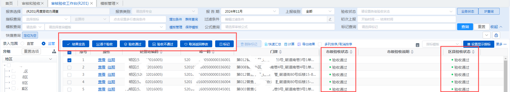

> 图片内容(可检索): 首页
审核和验收×
审核验收工作台（R201）X
模板管理X
请选择专业
报表类别
全部
请设置各级验收状态
业务状态
报表选择
报告期
2024年11月
上报级别
验收状态
(R201)月度劳动力调查
IP查询
指标查询
选择指标
运算符
增加条件
过滤条件
点击设置多行查询条件
表样查询
编辐过滤条件
初次上报
开始时间 ---结束时间
重置
模板查询
请选择
请选择审核公式
标记查询
请选择标记
查询
请选择查询模板
公式查询
模板管理
保存模板
收起
快捷查询
定位为空
直管
录入范围
监管
日标记
园计算
结果全选
吕逐个验收
验收通过
3 验收不通过
四 删除标记
目快速汇总
E导出结果
指标模板
出 设置显示指标
取消返回修改
多列排序/取消排序
分组
重置选项
门牌专
市级验收状态
市级验收说明
操作
区县验收状态
地区
查看
往期
明区(5
7016005)
520
10500000336001
第012音
3号箭道南巷3号1单.
验收通过
验收通过
明区(5
往期
2016005)
52010°
第008音。
000500000336002
南巷4号箭道南巷4号1单.
验收通过
验收通过
明区(52)
查看
往期
02016005)
5201.
1600500000336003
第012普一-
夏箭道街80号后楼15-B...
验收通过
验收通过
往期
明区(5,
.02016005)
查看
5201
第012普查_
复箭道街80号后楼15-.
验收通过
01600500000336004
验收通过
往期
查看
明区(5,
)2016005)
第003普查小
巷9号箭道南巷9号1单..
验收通过
1600500000345001
验收通过

## 第 64 页

**标题**: 4.4 审核和验收

未审核或审核未通过的数据不可做验收操作。可点击“查看”此户，然后点击“审核”按钮，数据无误即可重新进行验收。
图4-13

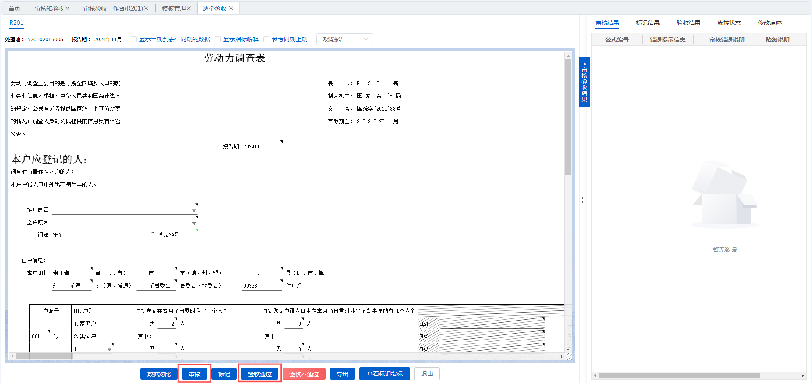

> 图片内容(可检索): 首页
模板管理×
审核和验收×
审核验收工作台(R201)×
逐个验收×
标记结果
R201
审核结果
验收结果
流转状态
修改痕迹
报告期：2024年11月
取消冻结
公式编号
处理地：520102016005
显示当期到去年同期的数据
口 显示指标解释
参考同期上期
审核错误说明
错误提示信息
降级说明
劳动力调查表
>审核验收结果
劳动力调查主要目的是了解全国城乡人口的就
号Ｒ２０1表
业失业信息。根据《中华人民共和国统计法》
制表机关：国家统计局
的规定；公民有义务提供国家统计调查所需要
号：国统字[2023]88号
的情况；调查人员对公民提供的信息负有保密
有效期至：2025年1月
义务。
报告期202411
本户应登记的人：
调查时点居住在本户的人；
本户户籍人口中外出不满半年的人。
换户原因
空户原因
门牌 第0
单元29号
暂无数据
住户信息：
本户地址
贵州省
省(区、市）
市(地、州、盟)
县 (区、市、旗)
街居委会
乡 (镇、街道)
居委会（村委会）
00336
住户组
户编号
H1.户别
H2.您家在本月10日零时住了几个人？
H3.您家户籍人口中在本月10日零时外出不满半年的有几个人？
1.家庭户
HA
2.集体户
其中：
001
其中:
H82
H43
数据对比
验收通过
验收不通过
查看标识指标
审核
标记
导出
退出

## 第 65 页

**标题**: 审核进度监测：可以实时查询每张报表审核的进度情况。

4.5 审核进度监测
图4-14

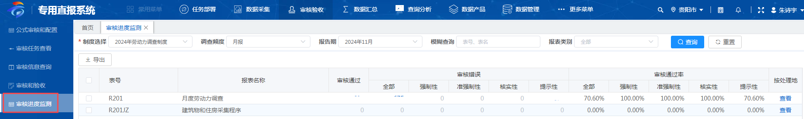

> 图片内容(可检索): 专用直报系统
常用菜单
任务部署
数据采集
数据汇总
查询分析
数据产品
数据管理
更多菜单
审核验收
贵阳市
，「朱诗宇
首页
围公式审核和配置
审核进度监测
调查频度
月报
报告期
模糊查询
报表类别
全部
Q查询
制度选择
2024年男动力调查制度
2024年11月
表号、表名
重置
一审核任务查看
用者不
口审核信息查询
审核错误
审核通过率
报表名称
审核通过
按处理地
审核和验收
全部
提示性
全部
强制性
准强制性
核实性
强制性
准强制性
核实性
提示性
R201
70.60%
70.60%
月度劳动力调查
100.00%
100.00%
100.00%
查看
围审核进度监测
0.00%
0.00%
0.00%
R201JZ
0.00%
0.00%
建筑物和住房采集程序
查看

## 第 66 页

**标题**: 验收进度监测：可以实时查询验收进度情况，支持按验收级别查看。

4.6 验收进度监测
图4-15

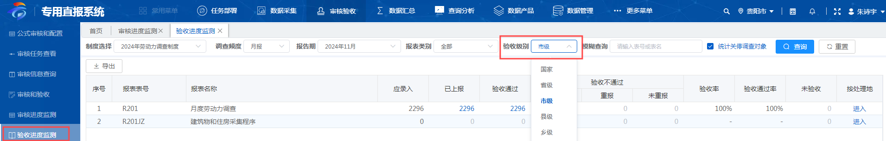

> 图片内容(可检索): 专用直报系统
88
常用菜单
任务部署
数据采集
数据汇总
查询分析
数据产品
数据管理
审核验收
更多菜单
贵阳市
朱诗宇
首页
审核进度监测X
围公式审核和配置
验收进度监测 X
制度选择
调查频度
月报
报告期
报表类别
全部
验收级别
市级
模糊查询
2024年11月
请输入表号或表名
统计关停调查对象
查询
2024年劳动力调查制度
重置
一审核任务查看
用者 不
国家
审核信息查询
省级
验收不通过
序号
应录入
验收率
报表表号
报表名称
已上报
验收通过
验收通过率
未验收
按处理地
审核和验收
重报
未重报
市级
R201
2296
2296
2296
月度劳动力调查
100%
100%
进入
围审核进度监测
县级
R201JZ
建筑物和住房采集程序
进入
验收进度监测
乡级

## 第 67 页

**标题**: 01

目录
平台登录
02
任务部署
03
数据采集
04
05
06
审核验收
数据汇总
数据管理

**备注**: 主要介绍内容包含
（1）系统的功能概述（2）开网前准备阶段（3）数据采集（4）审核验收 （5）数据汇总（6）查询分析

## 第 68 页

**标题**: 汇总执行，如下图：

汇总执行功能是指执行当前用户权限范围内的汇总表，汇总表执行分为加权汇总和普通汇总，加权汇总需要在汇总时选择权数，普通汇总不需要。（劳动力汇总为普通汇总）
  操作方法：选择汇总期别(默认最新)→选择汇总范围(默认全部)→选择过滤条件(默认无)→选择汇总条件（默认全部，可选城镇、乡村）→设置权数(仅加权汇总需要)→执行汇总/设置定时执行。汇总执行包含以下业务：
05 汇总执行
图5-1

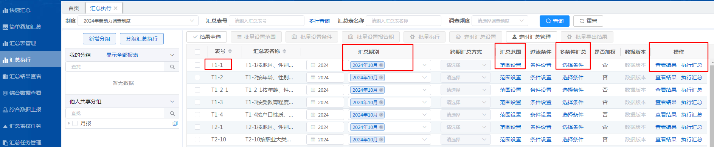

> 图片内容(可检索): 首页
山快速汇总
汇总执行 X
制度
2024年劳动力调查制度
汇总表号
多行查询
请输入汇总表名称
调查频度
请选择调查频度
Q查询
请输入汇总表号
汇总表名称
2 重置
简单爱加汇总
回 批量设置条件
回 批量设置报告期
批量执行
结果全选
三 批量设置范围
定时汇总管理
定时汇总设置
新增分组
分组汇总执行
批量导出结果
山汇总表管理
表号
汇总表名称
汇总期别
汇总范围
过滤条件
多条件汇总
是否加权
数据版本
跨期汇总方式
我的分组
显示全部报表
操作
山汇总执行
T1-1
T1-1按地区、性别...
2024年10月
请选择
范围设置
条件设置
选择条件
数据版本
查看结果
 2024
查找
执行汇总
汇总结果查看
T1-2
T1-2按年龄、性别...
请选择
范围设置
条件设置
选择条件
数据版本
查看结果
2024
2024年10月
执行汇总
暂无数据
T1-2-1
T1-2-1按年龄、性..
范围设置
请选择
条件设置
选择条件
数据版本
查看结果
 2024
2024年10月
剧综合数据查看
执行汇总
他人共享分组
请选择
T1-3
2024
T1-3按受教育程度..
范围设置
条件设置
选择条件
数据版本
查看结果
2024年10月
执行汇总
综合数据上报
查找
T1-4
请选择
T1-4按户口性质、
2024年10月
范围设置
条件设置
选择条件
2024
数据版本
查看结果
执行汇总
月报
汇总审核任务
请选择
T2-1
范围设置
条件设置
选择条件
T2-1按地区、性别..
2024
数据版本
查看结果
2024年10月
执行汇总
T2-10
请选择
条件设置
选择条件
T2-10按职业大类...
范围设置
数据版本
查看结果
2024
2024年10月
心汇总任务管理
执行汇总

## 第 69 页

**标题**: 3. 结果查看，如下图：

汇总完成后，可进行汇总结果的查看和导出，同时还支持多报告期的对比查看。
操作方法：结果查看→数据比对→结果共享
注意事项：
关于定版数据，每张汇总表每个报告期每个机构只能有一份定版数据；
关于结果共享，可共享给本机构其他用户。
05 汇总执行
图5-2

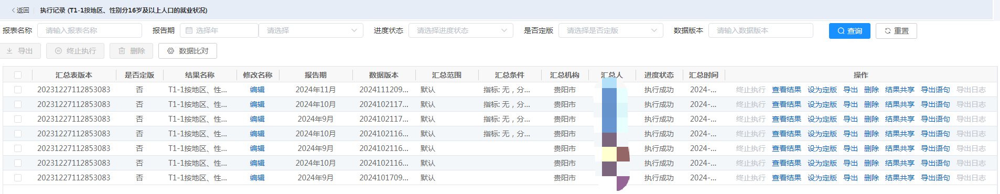

> 图片内容(可检索): <返回
执行记录（T1-1按地区、性别分16岁及以上人口的就业状况）
报告期
菌选择年
请选择
进度状态
是否定版
Q查询
报表名称
请输入报表名称
请选择进度状态
请选择是否定版
数据版本
请输入数据版本
2 重置
导出
终止执行
白 删除
数据比对
是否定版
修改名称
报告期
汇总范围
汇总条件
汇总机构
汇总人
进度状态
汇总时间
汇总表版本
结果名称
数据版本
操作
默认
2024.-..
T1-1按地区、性...
编辑
2024年11月
贵阳市
执行成功
终止执行
查看结果
设为定版
删除
结果共享
导出语句
20231227112853083
2024111209...
指标无，分..
导出日志
T1-1按地区、性...
2024年10月
编辑
默认
贵阳市
2024-...
终止执行
20231227112853083
2024102117...
指标无，分..
执行成功
查看结果
设为定版
删除
结果共享
导出语句
导出日志
2024年9月
T1-1按地区、性...
编辑
2024102117...
默认
贵阳市
2024.-..
终止执行
查看结果
20231227112853083
指标无，分..
执行成功
设为定版
册删除
结果共享
导出语句
导出日志
T1-1按地区、性...
编辑
2024年10月
默认
贵阳市
执行成功
2024-...
终止执行
查看结果
设为定版
删除
结果共享
导出语句
20231227112853083
2024102116...
指标无，分..
导出日志
2024年9月
默认
2024-..
终止执行
T1-1按地区、性...
编辑
2024102116...
贵阳市
执行成功
查看结果
设为定版
删除
结果共享
导出语句
20231227112853083
导出日志
编辑
2024年10月
T1-1按地区、性...
2024102116...
默认
贵阳市
2024-..
终止执行
查看结果
设为定版
删除
20231227112853083
执行成功
结果共享
导出语句
导出日志
2024年9月
默认
20231227112853083
T1-1按地区、性...
编辑
贵阳市
2024-...
终止执行
删除
2024101709...
执行成功
查看结果
设为定版
结果共享
导出语句
导出日志

## 第 70 页

**标题**: 01

目录
平台登录
02
任务部署
03
数据采集
04
05
06
审核验收
数据汇总
数据管理

**备注**: 主要介绍内容包含
（1）系统的功能概述（2）开网前准备阶段（3）数据采集（4）审核验收 （5）数据汇总（6）查询分析

## 第 71 页

**标题**: 定制导出，按报告期、导出模板、导出字段导出标识表。

6.1 数据导出
图6-1

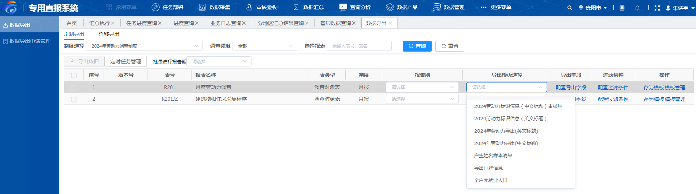

> 图片内容(可检索): 专用直报系统
品常用菜单
数据产品
任务部署
数据采集
审核验收
数据汇总
查询分析
数据管理
更多菜单
@贵阳市
：朱诗宇
首页
汇总执行×
任务进度查询×
进度查询×
业务日志查询×
分地区汇总结果查询X
基层数据查询×
数据导出
数据导出 ×
定制导出
迁移导出
日数据导出申请管理
制度选择
调查频度
全部
请输入表号、表名
Q 查询
2024年劳动力调查制度
选择报表
2 重置
导出数据
定时任务管理
批量选择报告期
请选择
序号
版本号
表号
报表名称
频度
报告期
导出模板选择
导出宇段
过滤条件
表类型
操作
R201
月报
请选择
月度劳动力调查
调查对象表
请选择
配置导出字段
配置过滤条件
存为模板模板管理
月报
调查对象表
R201JZ
建筑物和住房采集程序
请选择
I字段
配置过滤条件
存为模板模板管理
2024劳动力标识信息（中文标题）审核用
2024劳动力标识信息（英文标题）
2024年劳动力导出(英文标题)
2024年劳动力导出(中文标题)
户主姓名样本清单
导出门牌信息
全户无就业人口

## 第 72 页

**标题**: 可配置需要查看的字段。

6.1 数据导出
图6-2

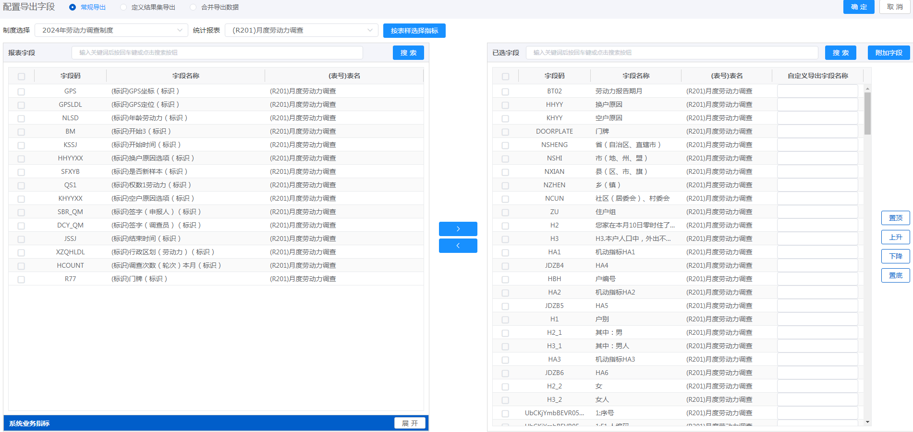

> 图片内容(可检索): 配置导出字段
常规导出
确定
定义结果集导出
合并导出数据
取消
制度选择
2024年劳动力调查制度
统计报表
(R201)月度劳动力调查
按表样选择指标
已选宇段
报表宇段
搜索
搜索
输入关键词后按回车键或点击搜索按钮
输入关键词后按回车键或点击搜索按钮
附加字段
宇段名称
宇段码
宇段码
(表号)表名
宇段名称
(表号)表名
自定义导出宇段名称
GPS
(标识)GPS坐标（标识）
BT02
(R201)月度劳动力调查
劳动力报告期月
(R201)月度劳动力调查
(标识)GPS定位（标识）
Hhyy
GPSLDL
(R201)月度劳动力调查
换户原因
(R201)月度劳动力调查
NLSD
(标识)年龄劳动力（标识）
KHYY
(R201)月度劳动力调查
空户原因
(R201)月度劳动力调查
BM
(标识)开始3（标识）
(R201)月度劳动力调查
DOORPLATE
门牌
(R201)月度劳动力调查
KSSJ
(标识)开始时间（标识）
(R201)月度劳动力调查
NSHENG
省（自治区、直辖市）
(R201)月度劳动力调查
HHYYXX
(R201)月度劳动力调查
NSHI
(标识)换户原因选项（标识）
市(地、州、盟)
(R201)月度劳动力调查
SFXYB
NXIAN
(标识)是否新样本（标识）
(R201)月度劳动力调查
县(区、市、旗)
(R201)月度劳动力调查
QS1
(标识)权数1劳动力（标识）
乡(镇)
NZHEN
(R201)月度劳动力调查
(R201)月度劳动力调查
KHYYXX
(标识)空户原因选项（标识）
(R201)月度劳动力调查
NCUN
社区（居委会）、村委会
(R201)月度劳动力调查
SBR_QM
(标识)签字（申报人）（标识）
住户组
(R201)月度劳动力调查
(R201)月度劳动力调查
置顶
DCY_QM
(标识)签字（调查员）（标识）
(R201)月度劳动力调查
H2
您家在本月10日零时住了..
(R201)月度劳动力调查
JSSJ
H3
H3.本户人口中，外出不...
(标识)结束时间（标识）
(R201)月度劳动力调查
(R201)月度劳动力调查
上升
XZQHLDL
(标识)行政区划（劳动力）（标识）
HA1
机动指标HA1
(R201)月度劳动力调查
(R201)月度劳动力调查
HCOUNT
(标识)调查次数（轮次）本月（标识）
(R201)月度劳动力调查
JDZB4
HA4
(R201)月度劳动力调查
户编号
R77
HBH
(标识)门牌（标识）
(R201)月度劳动力调查
(R201)月度劳动力调查
置底
HA2
机动指标HA2
(R201)月度劳动力调查
JDZB5
HA5
(R201)月度劳动力调查
H1
户别
(R201)月度劳动力调查
其中:男
H2_1
(R201)月度劳动力调查
H3_1
其中：男人
(R201)月度劳动力调查
HA3
机动指标HA3
(R201)月度劳动力调查
JDZB6
HA6
(R201)月度劳动力调查
H2_2
(R201)月度劳动力调查
H3_2
女人
(R201)月度劳动力调查
1;序号
UbCKjYmbBEVR05...
(R201)月度劳动力调查
系统业务指标
展开
c...I. Dr nar

## 第 73 页

**标题**: 配置好字段还可以存为模板，方便下次导出。

6.1 数据导出
图6-3

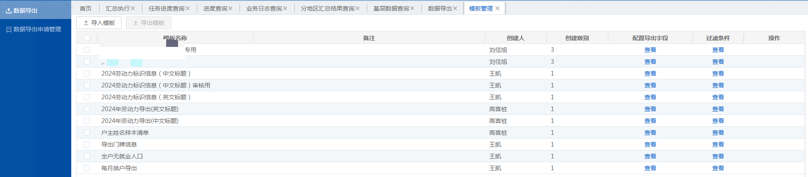

> 图片内容(可检索): 首页
汇总执行×
任务进度查询×
进度查询×
业务日志查询×
分地区汇总结果查询X
基层数据查询X
数据导出×
模板管理
 数据导出
个导入模板
业导出模板
日数据导出申请管理
模板名称
备注
创建人
过滤条件
创建级别
配置导出宇段
操作
刘佳旭
专用
查看
查看
刘佳旭
查看
查看
2024劳动力标识信息（中文标题）
王凯
查看
查看
2024劳动力标识信息（中文标题）审核用
王凯
查看
查看
王凯
2024劳动力标识信息（英文标题）
查看
查看
2024年劳动力导出(英文标题)
高喜桩
查看
查看
2024年劳动力导出(中文标题)
高喜桩
查看
查看
高喜桩
查看
户主姓名样本清单
查看
王凯
查看
导出门牌信息
查看
王凯
查看
全户无就业人口
查看
王凯
查看
每月换户导出
查看

## 第 74 页

**标题**: 地区范围全选，导出格式选择.xlsx、.xls、.et等。

6.1 数据导出
图6-4

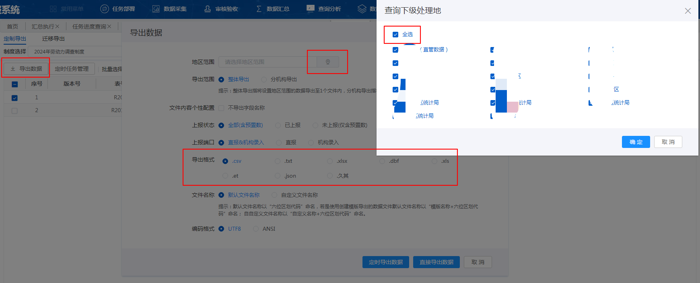

> 图片内容(可检索): 系统
品常用菜单
任务部署
数据采集
审核验收
数据汇总
查询分析
查询下级处理地
首页
汇总执行×
任务进度查询×
导出数据
全选
定制导出
迁移导出
（直管数据）
制度选择
2024年劳动力调查制度
地区范围
请选择地区范围
业导出数据
定时任务管理
批量选择
导出范围
分机构导出
序号
版本号
提示：整体导出指将设置地区范围的数据导出至1个文件内，分机构导出指
R2(
统计局
计局
统计局
文件内容个性配置
R20:
不导出字段名称
[统计局
上报状态
全部(含预置数)
已上报
未上报(仅含预置数)
直报
上报端口
直报&机构录入
确定
机构录入
取消
导出格式
.txt
.xlsx
.csv
.dbf
.xls
 json
.et
,久其
文件名称
o默认文件名称
自定义文件名称
提示：默认文件名称以“六位区划代码”命名，若是使用创建模版导出的数据文件默认文件名称以“模版名称+六位区划代
码”命名；自自定义文件名称以“自定义名称+六位区划代码”命名。
编码格式
UTF8
ANSI
定时导出数据
直接导出数据
取消

## 第 75 页

**标题**: 导出文件可自行命名，导出需要经过审核人审批。

6.1 数据导出
图6-5

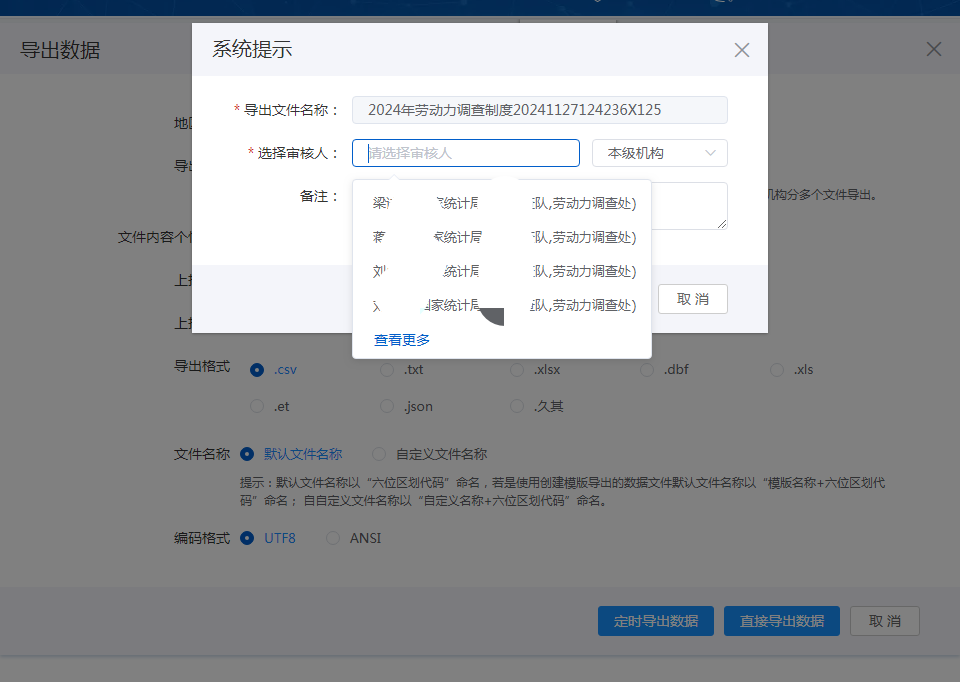

> 图片内容(可检索): 导出数据
系统提示
*导出文件名称：
2024年劳动力调查制度20241127124236X125
地[
*选择审核人：
请选择审核人
本级机构
备注：
统计局
队,劳动力调查处)
几构分多个文件导出。
文件内容个
家统计局
队,劳动力调查处)
统计后
队,劳动力调查处)
μ家统计局
队,劳动力调查处)
取消
查看更多
导出格式
.txt
.xlsx
.dbf
.xls
.et
 json
,久其
文件名称
默认文件名称
自定义文件名称
提示：默认文件名称以“六位区划代码”命名，若是使用创建模版导出的数据文件默认文件名称以“模版名称+六位区划代
码”命名；自自定义文件名称以“自定义名称+六位区划代码”命名。
0 UTF8
编码格式
ANSI
定时导出数据
直接导出数据
取消

## 第 76 页

**标题**: 6.2 数据导出申请管理

图6-6
一、查看申请的导出任务，并在更多菜单-消息管理-消息通知里下载导出数据。

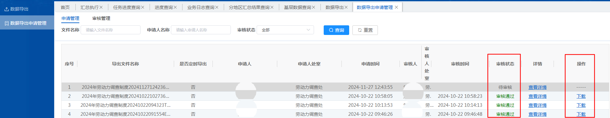

> 图片内容(可检索): 首页
汇总执行X
进度查询×
业务日志查询X
分地区汇总结果查询X
任务进度查询×
基层数据查询X
数据导出×
数据导出申请管理
数据导出
申请管理
审核管理
口数据导出申请管理
文件名称
请输入文件名称
请输入申请人名称
审核状态
Q查询
申请人名称
全部
2 重置
审核
序号
申请人
申请时间
审核人
详情
导出文件名称
是否定时导出
申请人处室
审核时间
审核状态
操作
劳.
2024年劳动力调查制度20241127124236..
劳动力调查处
2024-11-27 12:43:55
待审核
查看详情
2024年劳动力调查制度20241022102736...
劳.
2024-10-22 10:58:05
2024-10-22 10:58:23
审核通过
查看详情
劳动力调查处
下载
2024年劳动力调查制度20241022094323T..
劳..
审核通过
2024-10-22 10:13:53
2024-10-22 10:14:13
查看详情
劳动力调查处
下载
2024年劳动力调查制度20241022091554E...
劳动力调查处
2024-10-22 09:46:26
劳.
2024-10-22 09:46:48
审核通过
查看详情
下载

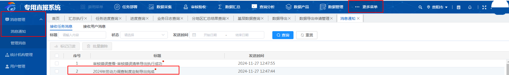

> 图片内容(可检索): 专用直报系统
常用菜单
任务部署
数据采集
数据汇总
查询分析
数据产品
审核验收
数据管理
更多菜单
贵阳市
首页
汇总执行×
任务进度查询X
进度查询×
业务日志查询
分地区汇总结果查询X
基层数据查询X
数据导出×
数据导出电请管理X
消息管理
消息通知×
接收任务消息
接收用户消息
消息通知
标题
请输入内容
状态
请选择
发送时间
开始日期
结束日期
查询
重置
管理消息
标记已读
回 批量删除
五统计机构管理
序号
标题
发送时间
核错误香看-审核错误清单导出执行成功
用户管理
2024-11-2712·47:55
2024年劳动力调查制度定制导出完成
2024-11-27 12:47:44

## 第 77 页

**标题**: 6.2 数据导出申请管理

图6-7
二、审核本级或下级其他人提交的导出申请

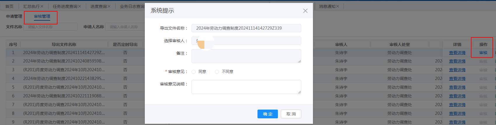

> 图片内容(可检索): 首页
进度查询×
汇总执行X
任务进度查询
业务日志查询
系统提示
消息通知X
申请管理
审核管理
文件名称
请输入文件名称
申请人名称
请输入申请人名称
导出文件名称：
2024年劳动力调查制度20241114142729Z339
选审核人：
序号
审核人
详情
导出文件名称
是否定时导出
审核人处室
操作
2024年劳动力调查制度20241114142729Z..
朱诗宇
劳动力调查处
查看详情
备注：
审核
朱诗宇
2024年劳动力调查制度20241024085959B...
劳动力调查处
202
查看详情
审核
朱诗宇
(R201)月度劳动力调查2024年10月202410.
劳动力调查处
202
查看详情
*审核意见：
同意
不同意
审核
2024年劳动力调查制度20241022143829S...
朱诗宇
劳动力调查处
202.
查看详情
审核
审核意见说明：
(R201)月度劳动力调查2024年10月202410..
朱诗宇
劳动力调查处
202
查看详情
审核
2024年劳动力调查制度20241022111908B...
朱诗宇
劳动力调查处
202
查看详情
审核
朱诗宇
(R201)月度劳动力调查2024年10月202410..
劳动力调查处
202.
查看详情
审核
朱诗宇
202
(R201)月度劳动力调查2024年10月202410..
确定
取消
劳动力调查处
查看详情
审核
朱诗宇
(R201)月度劳动力调查2024年10月202410.
劳动力调查处
202
查看详情
审核

## 第 78 页

**标题**: 6.2 数据导出申请管理

图6-8
三、新增本级审核人：具体请参考8月下发的《附件3  统计云联网直报系统管理员操作手册》中第6.1条。（新增审批人需由本单位统计云管理员才能操作，更多菜单-角色管理）

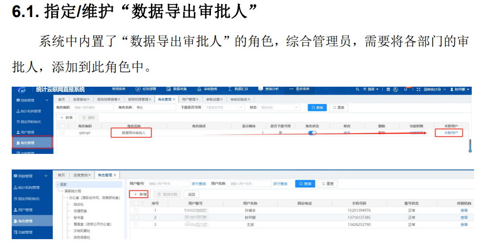

> 图片内容(可检索): 6.1.指定/维护“数据导出审批人”
批人，添加到此角色中
统计云联网直报系统
常用草单
?任务酒
审模验收
查询分析
.更多菜单
Q国家一国国家流计V
三陈甲话
首页
进度查询×
报告结果查看×
报表投限管理X
角色管理X
用户管理X
参款设置X
中消息管理
统和检收X
角色编码
角色名
下级是否可用
下象量高可用
免色状态
Q查询
小统计机构管理
角色编码
角色脆速
角色状态
是吾下吸可用
关获用户
三用户管理
数系导出审批人
sjdcspr
关职用户
主角色营理
进度查询×
中润电管理
角色管理×
用户联号
清编入用产账号
多行面询
用户名称
请能入用产名序
多行直询
Q查询
国家
统计机构管理
—国家院计局
取消关联
办公室(围际合作司、改策群究室)
用户账号
用户名标
同定电话
手机号码
账号状惠
综会处
质属机构
二用户管理
孙福全
15201394976
正常
总殖班室
秘书室
陈甲
13716137385
正常
专角色管理
智重室(改男公开办公室）
王波
13426252790
正常
E功能管理
文电机要处
政务信息处

## 第 79 页

**标题**: 谢谢！

> 图片内容(可检索): WW

